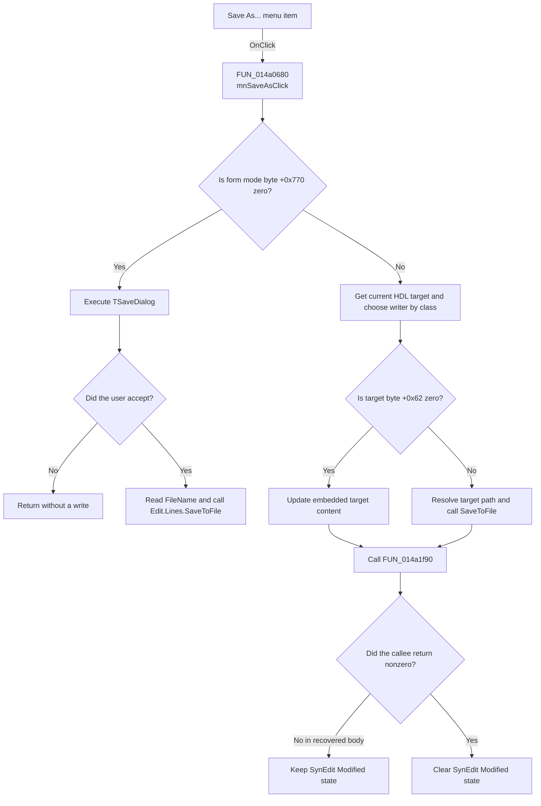

# Save As...

> Analysis status: Recovered two-mode Save As path reviewed.

## Control

| Property | Recovered value |
| --- | --- |
| Form | VhdlEditor |
| Component path | VhdlEditor.mnMainMenu.mnFile.mnSaveAs |
| Control class | TMenuItem |
| Caption | Save As... |
| Hint | Not present in the recovered resource. |
| Text | Not present in the recovered resource. |
| Handler name | mnSaveAsClick |
| Handler address | 014a0680 |
| Graph node | `resource:dfm:VhdlEditor/VhdlEditor.mnMainMenu.mnFile.mnSaveAs` |
| Handler node | `function:014a0680` |
| Graph layer | UI |

## What happens when clicked

`mnSaveAsClick` uses form mode byte `+0x770` to select one of two paths.

When the byte is zero, the handler executes the form's `TSaveDialog` at
`+0x718`. Cancel returns without reading a file name or writing a file. After
acceptance, the handler reads `SaveDialog.FileName` and passes it to the
one-argument `SaveToFile` virtual method of `Edit.Lines`. This writes the live
editor text to the chosen file. The handler supplies no encoding argument and
does not clear SynEdit's Modified state after this file branch.

When the mode byte is nonzero, the handler does not open the Save dialog. It
gets the current HDL target from application state at `+0x2768`, selects one of
two target writers by recovered class test, and passes `Edit.Lines` to that
writer. Both recovered writers have the same behavior: target byte `+0x62`
selects either an embedded-content update through target field `+0xb0` or a
`SaveToFile` call to the external path resolved from target string `+0x48`.

The nonzero-mode branch then calls `FUN_014a1f90` with its first argument set
to 1. In the recovered body, this callee always returns zero. The following
Modified-state clear is therefore not reached. The handler has no success
message, local error handler, temporary-file replacement, or rollback.

## Click flow

## Handler evidence

- Source: [DecompiledSources/Tina16/functions/00000000014A0680__FUN_014a0680.c](../../../DecompiledSources/Tina16/functions/00000000014A0680__FUN_014a0680.c)
- Recovered role: Saves editor text to a chosen file or the current HDL target,
  according to form mode.
- Current graph summary: Handles 1 Delphi UI event: VhdlEditor.mnMainMenu.mnFile.mnSaveAs.OnClick.
- Current graph behavior: Runs a file Save As flow in mode zero. In nonzero
  mode, writes to the current embedded or external HDL target and tests a
  follow-up result before it can clear Modified state.
- Current graph evidence: `FUN_014a0680` tests form byte `+0x770`, executes the
  dialog at `+0x718`, accesses `Edit.Lines` through form field `+0x740`, selects
  `FUN_014a0090` or `FUN_014a0130` by class test, and calls `FUN_014a1f90`.
- Complexity: complex
- Distinct outgoing calls: 7

## Direct calls

- `function:004113d0` — performs the recovered HDL target class test.
- `function:00414480` — Delphi UnicodeString clear and finalization helper
- `function:00724270` — gets the accepted dialog filename.
- `function:00c0dad0` — sets SynEdit's Modified state and refreshes dependent
  editor state.
- `function:014a0090` — writes editor lines to one recovered HDL target class.
- `function:014a0130` — writes editor lines to the alternate recovered HDL
  target class; its recovered body is identical to `FUN_014a0090`.
- `function:014a1f90` — performs managed-record housekeeping and returns zero
  in the recovered body; its intended application role is not recovered.

## Resource evidence

- Kind: Not present in the recovered resource.
- Modal result: Not present in the recovered resource.
- Checked state: Not present in the recovered resource.
- List items: Not present in the recovered resource.
- Image reference: Not present in the recovered resource.
- Extracted glyph: None.

## Nearby label candidates

Nearby labels are layout candidates only. They are not proof of behavior.

- No same-parent label candidate is available.

## Analysis limits

- The original names of mode byte `+0x770` and the two HDL target classes are
  not recovered. Their branch behavior is explicit.
- The one-argument `SaveToFile` call uses the line collection's current or
  default encoding. Exact encoding, preamble, and line endings are not supplied
  by this handler.
- The handler does not test an accepted filename for an empty value. File-system
  errors propagate through the VCL writer without local recovery.
- `FUN_014a1f90` always returns zero in the recovered source. The intended
  meaning of its result remains unknown; this article reports only its proven
  effect on the Modified-state branch.
