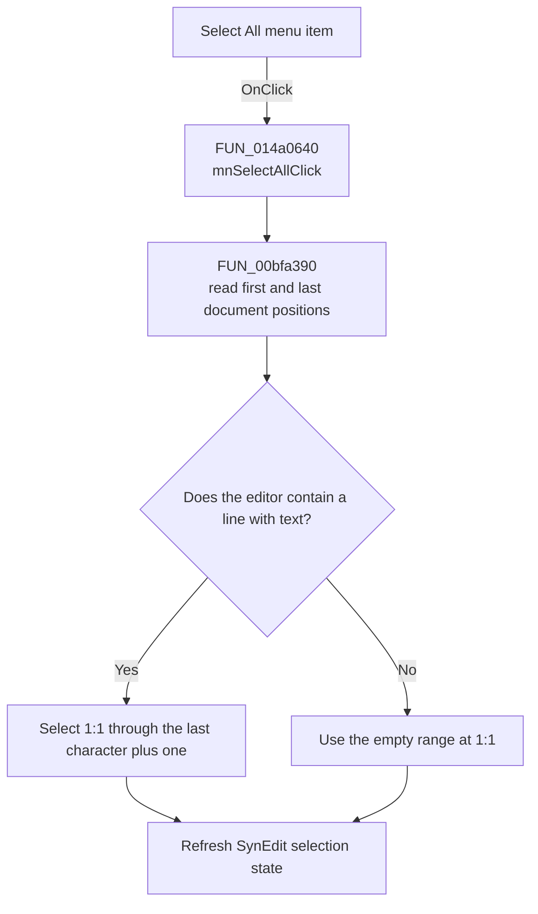

# Select All

> Analysis status: Recovered complete-document selection path reviewed.

## Control

| Property | Recovered value |
| --- | --- |
| Form | VhdlEditor |
| Component path | VhdlEditor.mnMainMenu.mnEdit.mnSelectAll |
| Control class | TMenuItem |
| Caption | Select All |
| Hint | Not present in the recovered resource. |
| Text | Not present in the recovered resource. |
| Handler name | mnSelectAllClick |
| Handler address | 014a0640 |
| Graph node | `resource:dfm:VhdlEditor/VhdlEditor.mnMainMenu.mnEdit.mnSelectAll` |
| Handler node | `function:014a0640` |
| Graph layer | UI |

## What happens when clicked

`mnSelectAllClick` passes the form's `TSynEdit` control at offset `+0x740` to
the shared SynEdit select-all helper. The helper builds a selection from line 1,
column 1 through one column after the final character of the last line. It
applies both endpoints and requests a selection-state refresh.

For an empty document, the computed start and end are both line 1, column 1.
The command then leaves an empty selection. It does not copy text, change the
document, save a file, or show an error.

## Click flow

## Handler evidence

- Source: [DecompiledSources/Tina16/functions/00000000014A0640__FUN_014a0640.c](../../../DecompiledSources/Tina16/functions/00000000014A0640__FUN_014a0640.c)
- Recovered role: Selects the complete VhdlEditor document.
- Current graph summary: Handles 1 Delphi UI event: VhdlEditor.mnMainMenu.mnEdit.mnSelectAll.OnClick.
- Current graph behavior: Delegates to the shared SynEdit select-all operation
  for the editor at form offset `+0x740`.
- Current graph evidence: `FUN_014a0640` contains only the field read and call
  to `FUN_00bfa390`. That helper calculates the final line and column, calls the
  recovered selection setter, and requests update flag `0x80`.
- Complexity: simple
- Distinct outgoing calls: 1

## Direct calls

- `function:00bfa390` — selects the complete SynEdit document, including its
  explicit empty-document boundary.

## Resource evidence

- Kind: Not present in the recovered resource.
- Modal result: Not present in the recovered resource.
- Checked state: Not present in the recovered resource.
- List items: Not present in the recovered resource.
- Image reference: Not present in the recovered resource.
- Extracted glyph: None.

## Nearby label candidates

Nearby labels are layout candidates only. They are not proof of behavior.

- No same-parent label candidate is available.

## Analysis limits

- The source proves the selection endpoints. It does not expose how a later
  command uses the selection.
- The menu shortcut value is recovered as `16449`; this article does not infer
  a key name from the numeric value.
