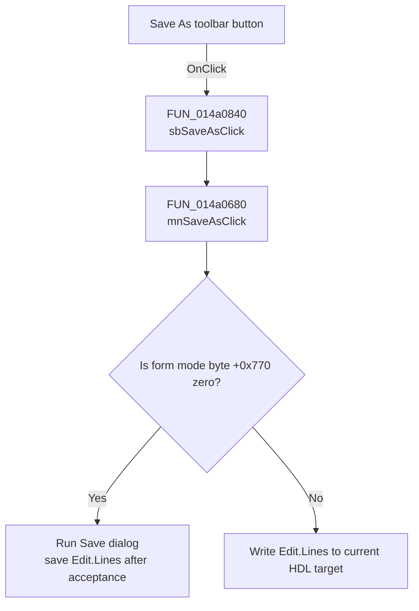

# Save As...

> Analysis status: Recovered toolbar delegation and shared Save As path reviewed.

## Control

| Property | Recovered value |
| --- | --- |
| Form | VhdlEditor |
| Component path | VhdlEditor.Panel1.Panel2.sbSaveAs |
| Control class | TSpeedButton |
| Caption | Not present in the recovered resource. |
| Hint | Save As... |
| Text | Not present in the recovered resource. |
| Handler name | sbSaveAsClick |
| Handler address | 014a0840 |
| Graph node | `resource:dfm:VhdlEditor/VhdlEditor.Panel1.Panel2.sbSaveAs` |
| Handler node | `function:014a0840` |
| Graph layer | UI |

## What happens when clicked

`sbSaveAsClick` is a one-call toolbar wrapper. It delegates to the same
[`mnSaveAsClick`](mnsaveas-670d1dbccb.md) handler as the **File > Save As...**
menu item. The preserved form instance remains the receiver even though the
decompiler omits the forwarded parameter at this small wrapper call site.

The shared handler uses form mode byte `+0x770`. Mode zero opens the Save dialog
and saves `Edit.Lines` to the accepted path. Nonzero mode writes the lines to
the current embedded or external HDL target without opening the dialog. Cancel
in the dialog branch is a no-op. The shared handler does not provide a success
message or local file-error recovery.

## Click flow

## Handler evidence

- Source: [DecompiledSources/Tina16/functions/00000000014A0840__FUN_014a0840.c](../../../DecompiledSources/Tina16/functions/00000000014A0840__FUN_014a0840.c)
- Recovered role: Delegates the toolbar Save As action to the menu Save As
  handler.
- Current graph summary: Handles 1 Delphi UI event: VhdlEditor.Panel1.Panel2.sbSaveAs.OnClick.
- Current graph behavior: Performs no independent decision or state change. It
  forwards to `FUN_014a0680`.
- Current graph evidence: The entire recovered body of `FUN_014a0840` is one
  call to `FUN_014a0680` followed by return.
- Complexity: simple
- Distinct outgoing calls: 1

## Direct calls

- `function:014a0680` — implements the reviewed two-mode Save As behavior.

## Resource evidence

- Kind: Not present in the recovered resource.
- Modal result: Not present in the recovered resource.
- Checked state: Not present in the recovered resource.
- List items: Not present in the recovered resource.
- Image reference: Not present in the recovered resource.
- Extracted glyph: [`0504_VhdlEditor_VhdlEditor_Panel1_Panel2_sbSaveAs_Glyph_Data.png`](../../../glyph/0504_VhdlEditor_VhdlEditor_Panel1_Panel2_sbSaveAs_Glyph_Data.png)

## Nearby label candidates

Nearby labels are layout candidates only. They are not proof of behavior.

- No same-parent label candidate is available.

## Analysis limits

- The extracted 32-by-16 glyph is a two-frame image, consistent with
  `NumGlyphs = 2`, and includes document and arrow imagery. The source handler,
  not the glyph, proves the Save As behavior.
- See the linked menu article for the unresolved mode-field name, output
  encoding, and `FUN_014a1f90` result limit.
