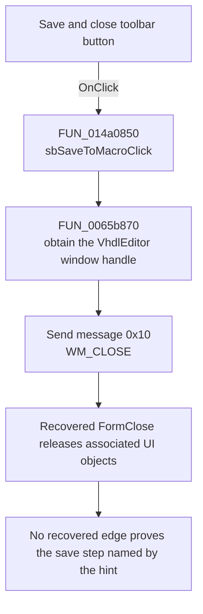

# Save & close

> Analysis status: Recovered WM_CLOSE request; save linkage remains unproven.

## Control

| Property | Recovered value |
| --- | --- |
| Form | VhdlEditor |
| Component path | VhdlEditor.Panel1.Panel2.sbSaveToMacro |
| Control class | TSpeedButton |
| Caption | Not present in the recovered resource. |
| Hint | Save & close |
| Text | Not present in the recovered resource. |
| Handler name | sbSaveToMacroClick |
| Handler address | 014a0850 |
| Graph node | `resource:dfm:VhdlEditor/VhdlEditor.Panel1.Panel2.sbSaveToMacro` |
| Handler node | `function:014a0850` |
| Graph layer | UI |

## What happens when clicked

`sbSaveToMacroClick` obtains the VhdlEditor window handle through
`FUN_0065b870` and passes that handle to the recovered window-message thunk with
message value `0x10`, `wParam = 0`, and `lParam = 0`. Win32 message `0x10` is
`WM_CLOSE`, so the proven direct effect is a request to close the editor.

The request reaches the normal form-close route. The recovered DFM binds
`FormClose` at `014a02c0`; that handler clears an associated object's active
byte, releases recovered per-tree-node objects when required, sets the VCL
close action to 2, and returns. Neither this click handler nor the recovered
`FormClose` event calls `mnSaveClick`, `mnSaveAsClick`, or an editor-lines writer.

The hint and two-frame disk glyph identify this control as **Save & close**,
but those resources cannot prove a save. A nearby unbound routine at
`014a01d0` can write editor lines in nonzero mode, but the current graph has no
edge from this click or the recovered close handler to that routine. Therefore,
the save part of the label remains an exact recovered-call-path gap. This
article does not invent that connection.

## Click flow

## Handler evidence

- Source: [DecompiledSources/Tina16/functions/00000000014A0850__FUN_014a0850.c](../../../DecompiledSources/Tina16/functions/00000000014A0850__FUN_014a0850.c)
- Recovered role: Requests that VhdlEditor close through `WM_CLOSE`; the hinted
  save step is not connected in the recovered graph.
- Current graph summary: Handles 1 Delphi UI event: VhdlEditor.Panel1.Panel2.sbSaveToMacro.OnClick.
- Current graph behavior: Obtains a window handle and sends message `0x10` with
  zero message parameters.
- Current graph evidence: `FUN_014a0850` calls `FUN_0065b870`, then calls the
  recovered message thunk with `(handle, 0x10, 0, 0)`. The DFM maps `FormClose`
  to `FUN_014a02c0`, whose recovered body contains no editor-lines writer.
- Complexity: simple
- Distinct outgoing calls: 1

## Direct calls

- `function:0065b870` — ensures the control window handle exists and returns
  the handle stored at control offset `+0x468`.

## Resource evidence

- Kind: Not present in the recovered resource.
- Modal result: Not present in the recovered resource.
- Checked state: Not present in the recovered resource.
- List items: Not present in the recovered resource.
- Image reference: Not present in the recovered resource.
- Extracted glyph: [`0503_VhdlEditor_VhdlEditor_Panel1_Panel2_sbSaveToMacro_Glyph_Data.png`](../../../glyph/0503_VhdlEditor_VhdlEditor_Panel1_Panel2_sbSaveToMacro_Glyph_Data.png)

## Nearby label candidates

Nearby labels are layout candidates only. They are not proof of behavior.

- No same-parent label candidate is available.

## Analysis limits

- The extracted 40-by-20 resource contains two disk-image frames, consistent
  with `NumGlyphs = 2`. It supports the visible save cue but not a save call.
- The current graph and recovered source do not connect `WM_CLOSE` or
  `FormClose` to the nearby writer at `014a01d0`. That missing edge is the exact
  reason that the save part remains unproven.
- The window-message thunk is an indirect import dispatch and is not recorded
  as a direct function-call edge for this handler.
