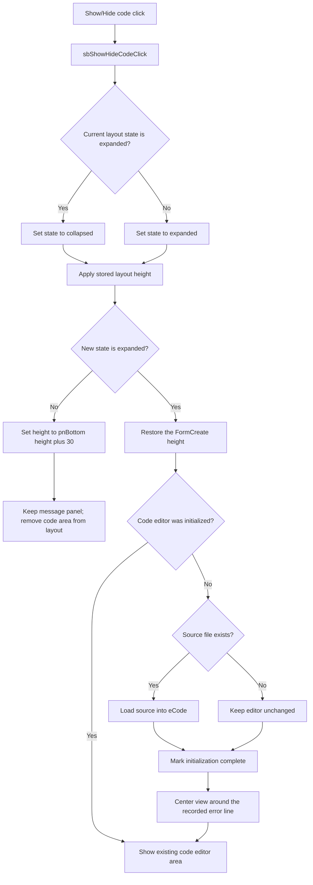

# Show/Hide code

## Control

| Property | Recovered value |
| --- | --- |
| Form | VhdlMessageWindow |
| Component path | VhdlMessageWindow.pnBottom.Panel1.sbShowHideCode |
| Control class | TSpeedButton |
| Caption | Not present in the recovered resource. |
| Hint | Show/Hide code |
| Text | Not present in the recovered resource. |
| Handler name | sbShowHideCodeClick |
| Handler address | 015e7220 |
| Graph node | `resource:dfm:VhdlMessageWindow/VhdlMessageWindow.pnBottom.Panel1.sbShowHideCode` |
| Handler node | `function:015e7220` |
| Graph layer | UI |

## What happens when clicked

The click alternates the HDL Message Window between its full height and a
message-only height. The handler changes a form state field at `+0x75C`: value
1 becomes 0, and every other value becomes 1. It then calls
`FUN_015e6f30` to apply the new layout.

The form records two heights during `FormCreate`:

- `+0x754` receives the complete window height that is active at creation.
- `+0x758` receives `pnBottom.Height + 30`, which is the height for the bottom
  message panel and the non-client window area.

For state 1, the layout helper restores the complete height. For state 0, it
sets the smaller height. The DFM aligns `pnBottom` to the bottom and `pnClient`
to the remaining client area. Therefore, the smaller height leaves the message
panel and its buttons available but removes the code editor area from the
layout. The handler does not change a `Visible` property and does not discard
the editor text.

The same layout helper also owns one-time code initialization. When it first
applies the expanded state, it tests the source-file path, loads an existing
file into the `eCode` editor, marks initialization complete, and moves the
editor view around the recorded error line. `FormShow` calls this helper while
the initial state is expanded, so a normal button click only changes the
height. If the source file does not exist during that first expanded pass, the
loader leaves the editor unchanged. The helper still marks initialization
complete and does not retry the file load on a later click.

The click has no confirmation, persistence action, error message, or rollback
path. It restores the complete height captured during `FormCreate`; it does not
calculate a new complete height from a later manual resize.

## Click flow

## Handler evidence

- Handler source: [FUN_015e7220](../../../DecompiledSources/Tina16/functions/00000000015E7220__FUN_015e7220.c)
- Layout helper: [FUN_015e6f30](../../../DecompiledSources/Tina16/functions/00000000015E6F30__FUN_015e6f30.c)
- Source loader: [FUN_015e6e80](../../../DecompiledSources/Tina16/functions/00000000015E6E80__FUN_015e6e80.c)
- Expanded-state predicate: [FUN_015e6da0](../../../DecompiledSources/Tina16/functions/00000000015E6DA0__FUN_015e6da0.c)
- Form initialization: [FUN_015e7250](../../../DecompiledSources/Tina16/functions/00000000015E7250__FUN_015e7250.c)
- Form-show path: [FUN_015e72f0](../../../DecompiledSources/Tina16/functions/00000000015E72F0__FUN_015e72f0.c)
- Recovered role: Toggle the HDL Message Window between code-expanded and
  message-only heights.
- Complexity: simple
- Distinct outgoing calls: 1

The DFM binds
`VhdlMessageWindow.pnBottom.Panel1.sbShowHideCode.OnClick` to
`sbShowHideCodeClick` at `015e7220`. The complete handler only changes state
`+0x75C` and calls the shared layout helper. `FUN_0064cc50`, which that helper
uses for both states, applies a new component height while it keeps the current
left, top, and width values.

## Direct calls

- `function:015e6f30` - apply the selected window height and, on the first
  expanded pass, initialize the source editor.

## Resource evidence

- The form caption is `HDL Message Window`.
- `pnBottom` is a 150-pixel-high bottom-aligned panel. It contains the message
  memo, the Show/Hide code button, and the OK, Cancel, and Help buttons.
- `pnClient` fills the remaining client area and contains the `eCode` SynEdit
  source editor and its line-and-column status panel.
- The control has the hint `Show/Hide code`, no caption, and `NumGlyphs = 2`.
- The extracted 32 by 16 raster contains two 16-pixel button-glyph frames:
  [Show/Hide code glyph](../../../glyph/0505_VhdlMessageWindow_VhdlMessageWindow_pnBottom_Panel1_sbShowHideCode_Glyph_Data.png).
  The hint and source establish the behavior; the glyph alone does not.

## Nearby label candidates

Nearby labels are layout candidates only. They are not proof of behavior.

- No same-parent label candidate is available.

## Analysis limits

- The recovered source does not explain why the collapsed-height constant adds
  exactly 30 pixels to `pnBottom.Height`.
- The first expanded initialization marks itself complete even when the source
  file is absent. The recovered click path provides no retry command.
