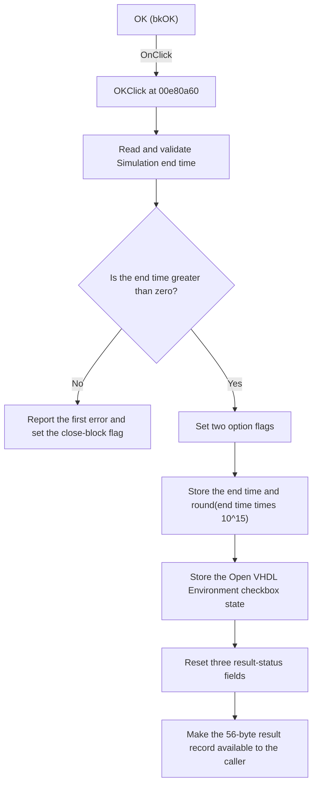

# OK

> Analysis status: Reviewed from recovered source and graph evidence.

## Control

| Property | Recovered value |
| --- | --- |
| Form | VhdlOptions3 |
| Component path | VhdlOptions3.OK |
| Control class | TBitBtn |
| Caption | Not present in the recovered resource. |
| Hint | Not present in the recovered resource. |
| Text | Not present in the recovered resource. |
| Handler name | OKClick |
| Handler address | 00e80a60 |
| Graph node | `resource:dfm:VhdlOptions3/VhdlOptions3.OK` |
| Handler node | `function:00e80a60` |
| Graph layer | UI |

## What happens when clicked

The handler reads and validates the Simulation end time edit. If the value is not greater than zero, it loads message resource `0x134`, reports the first error, sets the form's error flag, and does not build the result record. `FormCloseQuery` rejects the close request while this flag is set and then clears the flag.

If the value is valid and no edit error is active, the handler builds a packed result record at form offset `0x6e0`. It sets two option bytes to `1`, stores the floating-point end time, and stores a second representation calculated as `round(end time * 10^15)`. It also stores the state of the `Open the VHDL Environment` checkbox and resets two one-byte status fields and one four-byte status field to zero. The recovered `FUN_00e80c50` getter copies this 56-byte record to the caller.

The checkbox is hidden and disabled in the recovered resource, but the handler still reads its state. The recovered code does not show what later code does with that state. The handler does not show a success message and has no explicit close call.

## Click flow

## Handler evidence

- Source: [DecompiledSources/Tina16/functions/0000000000E80A60__FUN_00e80a60.c](../../../DecompiledSources/Tina16/functions/0000000000E80A60__FUN_00e80a60.c)
- Recovered role: Validates the simulation end time and builds the digital timing options record.
- Current graph summary: Handles 1 Delphi UI event: VhdlOptions3.OK.OnClick.
- Current graph behavior: The handler validates a positive simulation end time and prepares a packed result record with the time, its scaled integer form, the checkbox state, option flags, and reset status fields.
- Current graph evidence: `OKClick` reads the `TFloatEdit` at form offset `0x6b8`, tests the result against zero, and writes the accepted value to packed offset `0x6e6`. `FUN_015f6540` multiplies it by `10^15` and rounds it before storage at `0x6ee`. The handler gets the checkbox state from the control at `0x6d8`, stores it at `0x702`, and writes the other flag and status fields. `FUN_00e80c50` copies the complete result record out of the form.
- Complexity: complex
- Distinct outgoing calls: 9

## Direct calls

- `function:00414480` — Delphi UnicodeString clear and finalization helper
- `function:00417580` — Initializes a compiler-managed record used by the handler.
- `function:00417740` — Finalizes the compiler-managed record before return.
- `function:00417c40` — Copies the managed record with its recovered type information.
- `function:00b89270` — Gets the application resource context used for the error message.
- `function:00b8e520` — Loads message resource `0x134` for a non-positive end time.
- `function:00b90090` — Reads and validates the Simulation end time `TFloatEdit` value.
- `function:00e80bf0` — Reports the first edit error and sets the flag that blocks the next close query.
- `function:015f6540` — Multiplies the end time by `10^15` and rounds it to a 64-bit integer.

## Resource evidence

- Kind: bkOK
- Modal result: Not present in the recovered resource.
- Checked state: Not present in the recovered resource.
- List items: Not present in the recovered resource.
- Image reference: Not present in the recovered resource.
- Extracted glyph: None.

## Nearby label candidates

Nearby labels are layout candidates only. They are not proof of behavior.

- Rank 1: &Simulation end time:  at distance 71.

## Analysis limits

- The original Delphi field names for the packed result flags and status fields are not recovered.
- The localized text for message resource `0x134` is not present in the recovered source.
- The purpose of the separate 704-byte compiler-managed global record is not recovered. This article does not assign it a digital-timing role.
- The handler records the hidden checkbox state, but the downstream behavior of that state is outside the recovered click path.
- The resource identifies the button as `bkOK`, but it does not contain a separate modal-result value.
