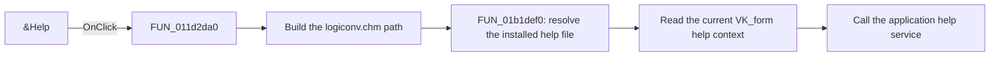

# &Help

> Analysis status: Reviewed from recovered source, UI, and glyph evidence.

## Control

| Property | Recovered value |
| --- | --- |
| Form | VK_form |
| Component path | VK_form.BtnHelp |
| Control class | TBitBtn |
| Caption | &Help |
| Hint | Not present in the recovered resource. |
| Text | Not present in the recovered resource. |
| Handler name | BtnHelpClick |
| Handler address | 011d2da0 |
| Graph node | `resource:dfm:VK_form/VK_form.BtnHelp` |
| Handler node | `function:011d2da0` |
| Graph layer | UI |

## What happens when clicked

The handler builds a path to `logiconv.chm`. `FUN_01b1def0` resolves an installed-file alternative when it exists and otherwise keeps the constructed path. The handler then calls the application help service with that file and the current shared help-context ID.

The context depends on the last VK_form action. The form surface uses `3000`, Minterm uses `3100`, Maxterm uses `3200`, and the display options use `3300`. The extracted glyph shows two question marks and supports the recovered help action. The handler has no explicit branch for a help-service failure.

## Click flow

## Handler evidence

- Source: [DecompiledSources/Tina16/functions/00000000011D2DA0__FUN_011d2da0.c](../../../DecompiledSources/Tina16/functions/00000000011D2DA0__FUN_011d2da0.c)
- Recovered role: Open VK_form help at the current form-specific context.
- Current graph summary: Handles 1 Delphi UI event: VK_form.BtnHelp.OnClick.
- Current graph behavior: Resolves `logiconv.chm` and opens the current VK_form help topic through the application help service.
- Current graph evidence: The handler constructs a path with the literal `logiconv.chm`, calls `FUN_01b1def0`, and passes its result with `PTR_DAT_02004708` to the help-service virtual method.
- Complexity: complex
- Distinct outgoing calls: 3

## Direct calls

- `function:00414560` — Delphi UnicodeString array finalization helper
- `function:00416cd0` — FUN_00416cd0
- `function:01b1def0` — FUN_01b1def0

## Resource evidence

- Kind: Not present in the recovered resource.
- Modal result: Not present in the recovered resource.
- Checked state: Not present in the recovered resource.
- List items: Not present in the recovered resource.
- Image reference: Not present in the recovered resource.
- Extracted glyph: [`0506_VK_form_VK_form_BtnHelp_Glyph_Data.png`](../../../glyph/0506_VK_form_VK_form_BtnHelp_Glyph_Data.png)

## Nearby label candidates

Nearby labels are layout candidates only. They are not proof of behavior.

- Rank 1: Maxterm at distance 342.
- Rank 2: Minterm at distance 605.

## Analysis limits

- The recovered source does not expose the topic titles for context IDs `3000` through `3300`.
- The application help service handles missing or unreadable help files outside this handler.
