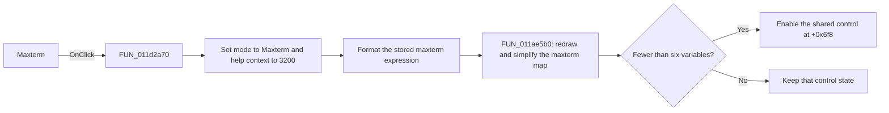

# Maxterm

> Analysis status: Reviewed from recovered source and UI evidence.

## Control

| Property | Recovered value |
| --- | --- |
| Form | VK_form |
| Component path | VK_form.BtnMaxterm |
| Control class | TRadioButton |
| Caption | Maxterm |
| Hint | Not present in the recovered resource. |
| Text | Not present in the recovered resource. |
| Handler name | BtnMaxtermClick |
| Handler address | 011d2a70 |
| Graph node | `resource:dfm:VK_form/VK_form.BtnMaxterm` |
| Handler node | `function:011d2a70` |
| Graph layer | UI |

## What happens when clicked

The handler sets the shared help-context ID to `3200` and sets the Karnaugh mode byte to `0`, which the renderer uses for the right Maxterm view. It reads the stored maxterm source expression, removes its final character, substitutes the configured Boolean variable display names, and writes the formatted source text to the form.

`FUN_011ae5b0` then redraws the maxterm map, generates its simplified product-of-sums expression, and publishes the result text. When the stored variable count is less than six, the handler also enables a shared application control at global form offset `+0x6f8`; that control's Delphi identity is not recovered here. The handler has no explicit error branch.

## Click flow

## Handler evidence

- Source: [DecompiledSources/Tina16/functions/00000000011D2A70__FUN_011d2a70.c](../../../DecompiledSources/Tina16/functions/00000000011D2A70__FUN_011d2a70.c)
- Recovered role: Select, redraw, and simplify the maxterm Karnaugh view.
- Current graph summary: Handles 1 Delphi UI event: VK_form.BtnMaxterm.OnClick.
- Current graph behavior: Selects maxterm mode, formats the stored maxterm expression, redraws the map, and publishes the simplified result.
- Current graph evidence: The handler writes `0` to `DAT_01f2a8d4`, reads the global string at offset `+0x798`, writes form control `+0x6c8`, and calls the annotated Karnaugh renderer `FUN_011ae5b0`.
- Complexity: complex
- Distinct outgoing calls: 7

## Direct calls

- `function:00414480` — Delphi UnicodeString clear and finalization helper
- `function:00414560` — Delphi UnicodeString array finalization helper
- `function:00416cd0` — FUN_00416cd0
- `function:00416dc0` — FUN_00416dc0
- `function:0064de00` — VCL control text setter with change suppression
- `function:00b971a0` — Boolean variable display-name substitution
- `function:011ae5b0` — Karnaugh-map renderer and simplified-expression generator

## Resource evidence

- Kind: Not present in the recovered resource.
- Modal result: Not present in the recovered resource.
- Checked state: Not present in the recovered resource.
- List items: Not present in the recovered resource.
- Image reference: Not present in the recovered resource.
- Extracted glyph: None.

## Nearby label candidates

Nearby labels are layout candidates only. They are not proof of behavior.

- Rank 1: Maxterm at distance 285.
- Rank 2: Minterm at distance 548.

## Analysis limits

- The shared control at global form offset `+0x6f8` has no recovered Delphi name.
- The removed final source-expression character is not identified by a recovered symbol.
