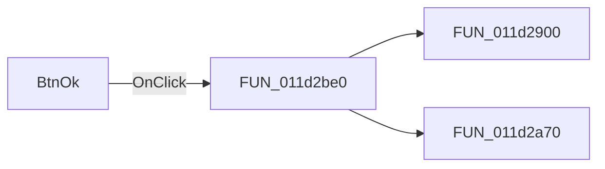

# BtnOk

> Analysis status: Pending individual source review.

## Control

| Property | Recovered value |
| --- | --- |
| Form | VK_form |
| Component path | VK_form.BtnOk |
| Control class | TBitBtn |
| Caption | Not present in the recovered resource. |
| Hint | Not present in the recovered resource. |
| Text | Not present in the recovered resource. |
| Handler name | BtnOkClick |
| Handler address | 011d2be0 |
| Graph node | `resource:dfm:VK_form/VK_form.BtnOk` |
| Handler node | `function:011d2be0` |
| Graph layer | UI |

## What happens when clicked

Pending individual analysis. An agent must read the recovered handler source and its relevant callees before it replaces this text.

## Click flow

## Handler evidence

- Source: [DecompiledSources/Tina16/functions/00000000011D2BE0__FUN_011d2be0.c](../../../DecompiledSources/Tina16/functions/00000000011D2BE0__FUN_011d2be0.c)
- Recovered role: Not present in the recovered resource.
- Current graph summary: Handles 1 Delphi UI event: VK_form.BtnOk.OnClick.
- Current graph behavior: Not present in the recovered resource.
- Current graph evidence: Not present in the recovered resource.
- Complexity: moderate
- Distinct outgoing calls: 2

## Direct calls

- `function:011d2900` — Handles 1 Delphi UI event: VK_form.BtnMinterm.OnClick.
- `function:011d2a70` — Handles 1 Delphi UI event: VK_form.BtnMaxterm.OnClick.

## Resource evidence

- Kind: bkOK
- Modal result: Not present in the recovered resource.
- Checked state: Not present in the recovered resource.
- List items: Not present in the recovered resource.
- Image reference: Not present in the recovered resource.
- Extracted glyph: None.

## Nearby label candidates

Nearby labels are layout candidates only. They are not proof of behavior.

- Rank 1: Maxterm at distance 309.
- Rank 2: Minterm at distance 572.

## Analysis limits

- Do not infer behavior from the control class, caption, hint, glyph, or nearby label alone.
- Do not replace the pending status until the handler source and relevant call path provide enough evidence.
