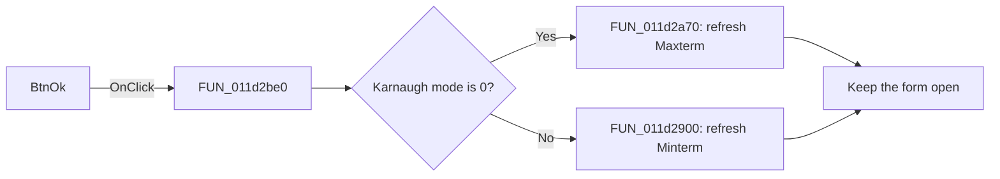

# BtnOk

> Analysis status: Reviewed from recovered source and UI evidence.

## Control

| Property | Recovered value |
| --- | --- |
| Form | VK_form |
| Component path | VK_form.BtnOk |
| Control class | TBitBtn |
| Caption | Not present in the recovered resource. |
| Hint | Not present in the recovered resource. |
| Text | Not present in the recovered resource. |
| Handler name | BtnOkClick |
| Handler address | 011d2be0 |
| Graph node | `resource:dfm:VK_form/VK_form.BtnOk` |
| Handler node | `function:011d2be0` |
| Graph layer | UI |

## What happens when clicked

The DFM marks this `bkOK` button as hidden. If its event runs, the handler reads the shared Karnaugh mode byte. Mode `0` dispatches to the Maxterm handler. Any nonzero mode dispatches to the Minterm handler.

The selected handler updates the help context, formats the corresponding stored source expression, redraws that map, and publishes its simplified expression. `BtnOkClick` does not set a modal result and does not close the form. Form activation calls this handler to synchronize the active view with the current Minterm radio-button state.

## Click flow

## Handler evidence

- Source: [DecompiledSources/Tina16/functions/00000000011D2BE0__FUN_011d2be0.c](../../../DecompiledSources/Tina16/functions/00000000011D2BE0__FUN_011d2be0.c)
- Recovered role: Dispatch the hidden VK_form refresh action to the current Karnaugh mode.
- Current graph summary: Handles 1 Delphi UI event: VK_form.BtnOk.OnClick.
- Current graph behavior: Calls the Maxterm refresh for mode `0` and the Minterm refresh for any other mode; it does not close the form.
- Current graph evidence: The recovered handler tests `DAT_01f2a8d4` and calls only `FUN_011d2a70` or `FUN_011d2900`. It contains no modal-result write. The DFM sets `Visible=false` and `Kind=bkOK`.
- Complexity: moderate
- Distinct outgoing calls: 2

## Direct calls

- `function:011d2900` — Handles 1 Delphi UI event: VK_form.BtnMinterm.OnClick.
- `function:011d2a70` — Handles 1 Delphi UI event: VK_form.BtnMaxterm.OnClick.

## Resource evidence

- Kind: bkOK
- Modal result: Not present in the recovered resource.
- Checked state: Not present in the recovered resource.
- List items: Not present in the recovered resource.
- Image reference: Not present in the recovered resource.
- Extracted glyph: None.

## Nearby label candidates

Nearby labels are layout candidates only. They are not proof of behavior.

- Rank 1: Maxterm at distance 309.
- Rank 2: Minterm at distance 572.

## Analysis limits

- The source does not show a normal visible user path to this hidden button.
- The built-in `bkOK` kind does not prove modal closure because this custom handler performs no close operation.
