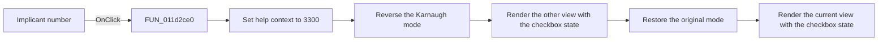

# Implicant number

> Analysis status: Reviewed from recovered source and UI evidence.

## Control

| Property | Recovered value |
| --- | --- |
| Form | VK_form |
| Component path | VK_form.GroupBox1.Check_M_ind |
| Control class | TCheckBox |
| Caption | Implicant number |
| Hint | Not present in the recovered resource. |
| Text | Not present in the recovered resource. |
| Handler name | Check_M_indClick |
| Handler address | 011d2ce0 |
| Graph node | `resource:dfm:VK_form/VK_form.GroupBox1.Check_M_ind` |
| Handler node | `function:011d2ce0` |
| Graph layer | UI |

## What happens when clicked

The checkbox state changes before this handler runs. The handler sets the shared help-context ID to `3300`. It then reverses the minterm-or-maxterm mode, renders one view, restores the original mode, and renders the other view.

The renderer reads `Check_M_ind` at form offset `+0x710`. When the checkbox is selected, it draws recovered implicant identifier strings at the group locations. When it is clear, it skips those identifier draws. The handler refreshes both views and leaves the selected Karnaugh mode unchanged. It has no error branch.

## Click flow

## Handler evidence

- Source: [DecompiledSources/Tina16/functions/00000000011D2CE0__FUN_011d2ce0.c](../../../DecompiledSources/Tina16/functions/00000000011D2CE0__FUN_011d2ce0.c)
- Recovered role: Show or hide implicant identifiers and refresh both Karnaugh views.
- Current graph summary: Handles 1 Delphi UI event: VK_form.GroupBox1.Check_M_ind.OnClick.
- Current graph behavior: Refreshes both maps after the implicant-number checkbox changes; the renderer draws identifier strings only while the checkbox is selected.
- Current graph evidence: The handler sets context `0xce4`, toggles `DAT_01f2a8d4` around two calls to `FUN_011ae5b0`, and restores the original mode. The renderer tests form control `+0x710` before its implicant-label draw calls.
- Complexity: simple
- Distinct outgoing calls: 1

## Direct calls

- `function:011ae5b0` — Karnaugh-map renderer and simplified-expression generator

## Resource evidence

- Kind: Not present in the recovered resource.
- Modal result: Not present in the recovered resource.
- Checked state: Not present in the recovered resource.
- List items: Not present in the recovered resource.
- Image reference: Not present in the recovered resource.
- Extracted glyph: None.

## Nearby label candidates

Nearby labels are layout candidates only. They are not proof of behavior.

- Rank 1: Don't care at distance 29.

## Analysis limits

- The recovered source does not provide semantic names for each implicant identifier string.
- The handler relies on the VCL checkbox state change that occurs before `OnClick`.
