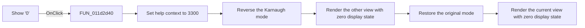

# Show '0'

> Analysis status: Reviewed from recovered source and UI evidence.

## Control

| Property | Recovered value |
| --- | --- |
| Form | VK_form |
| Component path | VK_form.GroupBox1.kell_nulla |
| Control class | TCheckBox |
| Caption | Show '0' |
| Hint | Not present in the recovered resource. |
| Text | Not present in the recovered resource. |
| Handler name | kell_nullaClick |
| Handler address | 011d2d40 |
| Graph node | `resource:dfm:VK_form/VK_form.GroupBox1.kell_nulla` |
| Handler node | `function:011d2d40` |
| Graph layer | UI |

## What happens when clicked

The checkbox state changes before this handler runs. The handler sets the shared help-context ID to `3300`. It reverses the minterm-or-maxterm mode and renders one view, then restores the original mode and renders the other view.

The renderer reads `kell_nulla` at form offset `+0x708`. When the checkbox is selected, it initializes zero-valued Karnaugh cells with the character `0`. When it is clear, it initializes those cells with a space. One-valued and don't-care cells are then applied from the stored truth function. The handler refreshes both views and leaves the selected mode unchanged. It has no error branch.

## Click flow

## Handler evidence

- Source: [DecompiledSources/Tina16/functions/00000000011D2D40__FUN_011d2d40.c](../../../DecompiledSources/Tina16/functions/00000000011D2D40__FUN_011d2d40.c)
- Recovered role: Change zero-value visibility and refresh both Karnaugh views.
- Current graph summary: Handles 1 Delphi UI event: VK_form.GroupBox1.kell_nulla.OnClick.
- Current graph behavior: Refreshes both maps after the zero-display checkbox changes; selected shows `0` for zero cells and clear leaves them blank.
- Current graph evidence: The handler sets context `0xce4`, toggles `DAT_01f2a8d4` around two calls to `FUN_011ae5b0`, and restores the mode. The renderer tests form control `+0x708` and chooses character `0x30` or `0x20` for the initial cell array.
- Complexity: simple
- Distinct outgoing calls: 1

## Direct calls

- `function:011ae5b0` — Karnaugh-map renderer and simplified-expression generator

## Resource evidence

- Kind: Not present in the recovered resource.
- Modal result: Not present in the recovered resource.
- Checked state: true
- List items: Not present in the recovered resource.
- Image reference: Not present in the recovered resource.
- Extracted glyph: None.

## Nearby label candidates

Nearby labels are layout candidates only. They are not proof of behavior.

- Rank 1: Don't care at distance 48.

## Analysis limits

- The renderer, not this handler, decides which stored truth values replace the initial zero or blank cells.
- The handler relies on the VCL checkbox state change that occurs before `OnClick`.
