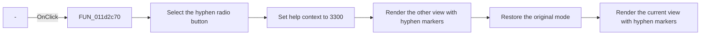

# -

> Analysis status: Reviewed from recovered source and UI evidence.

## Control

| Property | Recovered value |
| --- | --- |
| Form | VK_form |
| Component path | VK_form.GroupBox1.Minuszjel |
| Control class | TRadioButton |
| Caption | - |
| Hint | Not present in the recovered resource. |
| Text | Not present in the recovered resource. |
| Handler name | MinuszjelClick |
| Handler address | 011d2c70 |
| Graph node | `resource:dfm:VK_form/VK_form.GroupBox1.Minuszjel` |
| Handler node | `function:011d2c70` |
| Graph layer | UI |

## What happens when clicked

The handler sets the shared help-context ID to `3300` and explicitly selects the `-` radio button at form offset `+0x720`. It then reverses the minterm-or-maxterm mode, renders one view, restores the original mode, and renders the other view.

The renderer reads the `-` radio-button state. A selected state uses the hyphen character for don't-care cells. An unselected state uses `X`. The handler therefore refreshes both maps with `-` markers and leaves the selected Karnaugh mode unchanged. It has no error branch.

## Click flow

## Handler evidence

- Source: [DecompiledSources/Tina16/functions/00000000011D2C70__FUN_011d2c70.c](../../../DecompiledSources/Tina16/functions/00000000011D2C70__FUN_011d2c70.c)
- Recovered role: Use hyphens for don't-care cells and refresh both Karnaugh views.
- Current graph summary: Handles 1 Delphi UI event: VK_form.GroupBox1.Minuszjel.OnClick.
- Current graph behavior: Selects the hyphen marker and redraws both minterm and maxterm maps without changing the active mode.
- Current graph evidence: The handler sets the checked state of form control `+0x720`, toggles `DAT_01f2a8d4` around two renderer calls, and restores the mode. `FUN_011ae5b0` maps a selected `+0x720` control to character `0x2d`.
- Complexity: simple
- Distinct outgoing calls: 1

## Direct calls

- `function:011ae5b0` — Karnaugh-map renderer and simplified-expression generator

## Resource evidence

- Kind: Not present in the recovered resource.
- Modal result: Not present in the recovered resource.
- Checked state: true
- List items: Not present in the recovered resource.
- Image reference: Not present in the recovered resource.
- Extracted glyph: None.

## Nearby label candidates

Nearby labels are layout candidates only. They are not proof of behavior.

- Rank 1: Don't care at distance 24.

## Analysis limits

- The nearby `Don't care` label supports the group relationship, but the renderer's character branch establishes the behavior.
- The recovered field has no original Delphi declaration.
