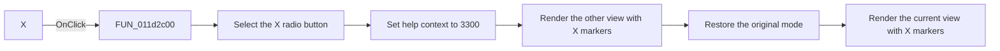

# X

> Analysis status: Reviewed from recovered source and UI evidence.

## Control

| Property | Recovered value |
| --- | --- |
| Form | VK_form |
| Component path | VK_form.GroupBox1.RadioButton2 |
| Control class | TRadioButton |
| Caption | X |
| Hint | Not present in the recovered resource. |
| Text | Not present in the recovered resource. |
| Handler name | RadioButton2Click |
| Handler address | 011d2c00 |
| Graph node | `resource:dfm:VK_form/VK_form.GroupBox1.RadioButton2` |
| Handler node | `function:011d2c00` |
| Graph layer | UI |

## What happens when clicked

The handler sets the shared help-context ID to `3300` and explicitly selects the `X` radio button at form offset `+0x728`. The radio group clears the `-` selection. The handler then reverses the minterm-or-maxterm mode, renders one view, restores the original mode, and renders the other view.

The renderer reads the `-` radio-button state at offset `+0x720`. Its clear state uses the character `X` for don't-care cells. The handler therefore refreshes both maps with `X` markers and leaves the selected Karnaugh mode unchanged. It has no error branch.

## Click flow

## Handler evidence

- Source: [DecompiledSources/Tina16/functions/00000000011D2C00__FUN_011d2c00.c](../../../DecompiledSources/Tina16/functions/00000000011D2C00__FUN_011d2c00.c)
- Recovered role: Use `X` for don't-care cells and refresh both Karnaugh views.
- Current graph summary: Handles 1 Delphi UI event: VK_form.GroupBox1.RadioButton2.OnClick.
- Current graph behavior: Selects the `X` marker and redraws both minterm and maxterm maps without changing the active mode.
- Current graph evidence: The handler sets the checked state of form control `+0x728`, toggles `DAT_01f2a8d4` around two renderer calls, and restores the mode. `FUN_011ae5b0` maps a clear `+0x720` control to character `0x58`.
- Complexity: simple
- Distinct outgoing calls: 1

## Direct calls

- `function:011ae5b0` — Karnaugh-map renderer and simplified-expression generator

## Resource evidence

- Kind: Not present in the recovered resource.
- Modal result: Not present in the recovered resource.
- Checked state: Not present in the recovered resource.
- List items: Not present in the recovered resource.
- Image reference: Not present in the recovered resource.
- Extracted glyph: None.

## Nearby label candidates

Nearby labels are layout candidates only. They are not proof of behavior.

- Rank 1: Don't care at distance 75.

## Analysis limits

- The nearby `Don't care` label supports the group relationship, but the renderer's character branch establishes the behavior.
- The renderer infers `X` from the clear state of the paired hyphen radio button.
