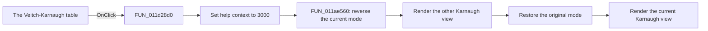

# The Veitch-Karnaugh table

> Analysis status: Reviewed from recovered source and UI evidence.

## Control

| Property | Recovered value |
| --- | --- |
| Form | VK_form |
| Component path | VK_form |
| Control class | TVK_form |
| Caption | The Veitch-Karnaugh table |
| Hint | Not present in the recovered resource. |
| Text | Not present in the recovered resource. |
| Handler name | FormClick |
| Handler address | 011d28d0 |
| Graph node | `resource:dfm:VK_form` |
| Handler node | `function:011d28d0` |
| Graph layer | UI |

## What happens when clicked

Clicking the form surface sets the shared help-context ID to `3000`. The handler then calls `FUN_011ae560` to refresh both Karnaugh views. That coordinator reverses the current minterm-or-maxterm mode, calls the renderer for the other view, restores the original mode, and calls the renderer again.

`FUN_011ae5b0` rebuilds each map from the stored truth function. It draws the grid, values, and implicant outlines. It also rebuilds the simplified Boolean expression and publishes the text to the form and shared result state. The click leaves the selected mode unchanged. The recovered path has no error or early-return branch.

## Click flow

## Handler evidence

- Source: [DecompiledSources/Tina16/functions/00000000011D28D0__FUN_011d28d0.c](../../../DecompiledSources/Tina16/functions/00000000011D28D0__FUN_011d28d0.c)
- Recovered role: Karnaugh form click refresh and help-context handler
- Current graph summary: Restores help-context ID 3000 when the Karnaugh form surface is clicked, then recalculates and repaints both minterm and maxterm Karnaugh views. Handles 1 Delphi UI event: VK_form.OnClick.
- Current graph behavior: Restores help-context ID 3000 when the Karnaugh form surface is clicked, then recalculates and repaints both minterm and maxterm Karnaugh views.
- Current graph evidence: VK_form.OnClick binds FormClick to this function. It stores 3000 and calls FUN_011ae560. Form creation and activation use the same context, and the OnHelp handler passes it with logiconv.chm to the help service.
- Complexity: simple
- Distinct outgoing calls: 1

## Direct calls

- `function:011ae560` — Dual minterm and maxterm Karnaugh-view refresh coordinator

## Resource evidence

- Kind: Not present in the recovered resource.
- Modal result: Not present in the recovered resource.
- Checked state: Not present in the recovered resource.
- List items: Not present in the recovered resource.
- Image reference: Not present in the recovered resource.
- Extracted glyph: None.

## Nearby label candidates

Nearby labels are layout candidates only. They are not proof of behavior.

- No same-parent label candidate is available.

## Analysis limits

- The recovered global mode byte has no Delphi field name.
- The form click does not report renderer failures or invalid stored truth-function data.
