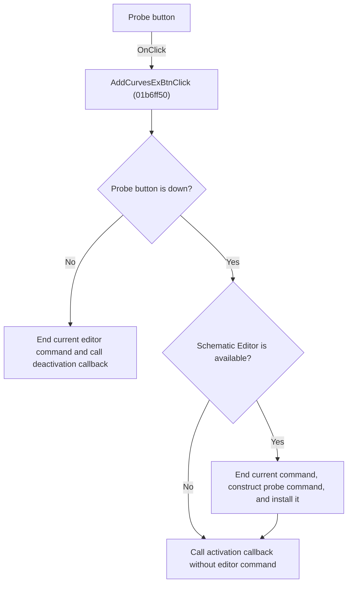

# Probe

> Analysis status: Individually reviewed.

## Control

| Property | Recovered value |
| --- | --- |
| Form | VoltmeterWin |
| Component path | VoltmeterWin.InputBox.FAddCurvesExBtn |
| Control class | TSpeedButton |
| Caption | Not present in the recovered resource. |
| Hint | Probe |
| Text | Not present in the recovered resource. |
| Handler name | AddCurvesExBtnClick |
| Handler address | 01b6ff50 |
| Graph node | `resource:dfm:VoltmeterWin/VoltmeterWin.InputBox.FAddCurvesExBtn` |
| Handler node | `function:01b6ff50` |
| Graph layer | UI |

## What happens when clicked

The Probe speed button is a toggle. When the button is down, the handler ends the current Schematic Editor command, constructs a probe-selection command for this Voltmeter, installs it in the editor, and calls the instrument activation callback. When the button is up, the handler ends the current editor command and calls the deactivation callback. If no Schematic Editor is available, the handler still calls the matching instrument callback but cannot install an editor command.

## Click flow

## Handler evidence

- Source: [DecompiledSources/Tina16/functions/0000000001B6FF50__FUN_01b6ff50.c](../../../DecompiledSources/Tina16/functions/0000000001B6FF50__FUN_01b6ff50.c)
- Recovered role: Toggle schematic probe selection for the Voltmeter.
- Current graph summary: Handles 1 Delphi UI event: VoltmeterWin.InputBox.FAddCurvesExBtn.OnClick.
- Current graph behavior: The Probe speed button is a toggle. When the button is down, the handler ends the current Schematic Editor command, constructs a probe-selection command for this Voltmeter, installs it in the editor, and calls the instrument activation callback. When the button is up, the handler ends the current editor command and calls the deactivation callback. If no Schematic Editor is available, the handler still calls the matching instrument callback but cannot install an editor command.
- Current graph evidence: FUN_01b6ff50 delegates to FUN_010e3f30. The callee reads the speed-button Down byte at the instrument field indexed by 0xF9, ends the current editor command through FUN_01c6cf20, constructs FUN_0136bdf0 with the current editor and instrument when Down is true, installs it through FUN_01c6cee0, and calls virtual slots 0x418 or 0x420 for the two states. The resource hint is Probe and the inspected glyph is a probe.
- Complexity: simple
- Distinct outgoing calls: 1

## Direct calls

- `function:010e3f30` — FUN_010e3f30

## Resource evidence

- Kind: Not present in the recovered resource.
- Modal result: Not present in the recovered resource.
- Checked state: Not present in the recovered resource.
- List items: Not present in the recovered resource.
- Image reference: Not present in the recovered resource.
- Extracted glyph: [`0507_VoltmeterWin_VoltmeterWin_InputBox_FAddCurvesExBtn_Glyph_Data.png`](../../../glyph/0507_VoltmeterWin_VoltmeterWin_InputBox_FAddCurvesExBtn_Glyph_Data.png)

## Nearby label candidates

Nearby labels are layout candidates only. They are not proof of behavior.

- Rank 1: &HI at distance 106.
- Rank 2: &LO at distance 118.

## Analysis limits

- The Delphi class name of the constructed probe command and the callback method names are not recovered.
- The nearby HI and LO labels do not prove which terminal a later probe click assigns.

