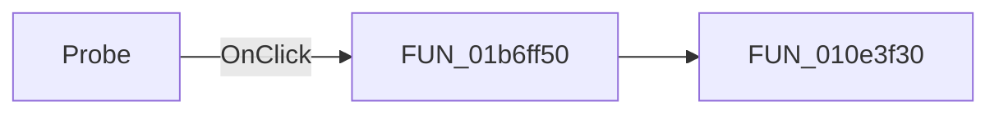

# Probe

> Analysis status: Pending individual source review.

## Control

| Property | Recovered value |
| --- | --- |
| Form | VoltmeterWin |
| Component path | VoltmeterWin.InputBox.FAddCurvesExBtn |
| Control class | TSpeedButton |
| Caption | Not present in the recovered resource. |
| Hint | Probe |
| Text | Not present in the recovered resource. |
| Handler name | AddCurvesExBtnClick |
| Handler address | 01b6ff50 |
| Graph node | `resource:dfm:VoltmeterWin/VoltmeterWin.InputBox.FAddCurvesExBtn` |
| Handler node | `function:01b6ff50` |
| Graph layer | UI |

## What happens when clicked

Pending individual analysis. An agent must read the recovered handler source and its relevant callees before it replaces this text.

## Click flow

## Handler evidence

- Source: [DecompiledSources/Tina16/functions/0000000001B6FF50__FUN_01b6ff50.c](../../../DecompiledSources/Tina16/functions/0000000001B6FF50__FUN_01b6ff50.c)
- Recovered role: Not present in the recovered resource.
- Current graph summary: Handles 1 Delphi UI event: VoltmeterWin.InputBox.FAddCurvesExBtn.OnClick.
- Current graph behavior: Not present in the recovered resource.
- Current graph evidence: Not present in the recovered resource.
- Complexity: simple
- Distinct outgoing calls: 1

## Direct calls

- `function:010e3f30` — FUN_010e3f30

## Resource evidence

- Kind: Not present in the recovered resource.
- Modal result: Not present in the recovered resource.
- Checked state: Not present in the recovered resource.
- List items: Not present in the recovered resource.
- Image reference: Not present in the recovered resource.
- Extracted glyph: [`0507_VoltmeterWin_VoltmeterWin_InputBox_FAddCurvesExBtn_Glyph_Data.png`](../../../glyph/0507_VoltmeterWin_VoltmeterWin_InputBox_FAddCurvesExBtn_Glyph_Data.png)

## Nearby label candidates

Nearby labels are layout candidates only. They are not proof of behavior.

- Rank 1: &HI at distance 106.
- Rank 2: &LO at distance 118.

## Analysis limits

- Do not infer behavior from the control class, caption, hint, glyph, or nearby label alone.
- Do not replace the pending status until the handler source and relevant call path provide enough evidence.
