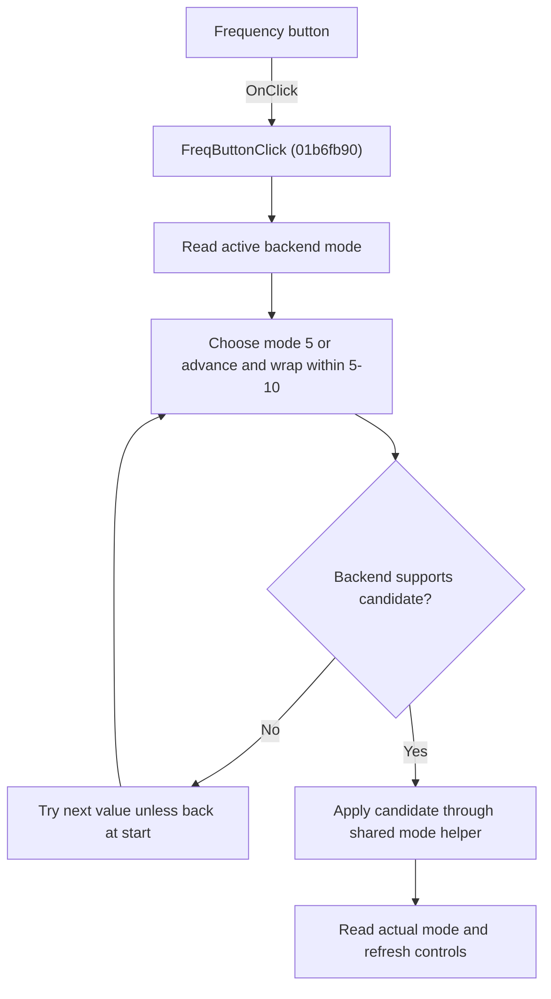

# Freq

> Analysis status: Individually reviewed.

## Control

| Property | Recovered value |
| --- | --- |
| Form | VoltmeterWin |
| Component path | VoltmeterWin.FunctionBox.FreqButton |
| Control class | TSpeedButton |
| Caption | Freq |
| Hint | Not present in the recovered resource. |
| Text | Not present in the recovered resource. |
| Handler name | FreqButtonClick |
| Handler address | 01b6fb90 |
| Graph node | `resource:dfm:VoltmeterWin/VoltmeterWin.FunctionBox.FreqButton` |
| Handler node | `function:01b6fb90` |
| Graph layer | UI |

## What happens when clicked

The handler reads the active meter mode. When that mode is in the recovered frequency-family range 5 through 10, it advances to the next value and wraps from 10 to 5. It asks the backend whether each candidate is supported and continues until a supported value is found or it returns to the starting value. A mode outside this range starts the search at 5. The handler applies the selected value through the shared mode helper, reads the actual backend mode, and refreshes the controls. The recovered UI renderer labels mode 5 as Freq and mode 10 as Diode; the four intermediate labels are not recovered as text. The click does not start a measurement.

## Click flow

## Handler evidence

- Source: [DecompiledSources/Tina16/functions/0000000001B6FB90__FUN_01b6fb90.c](../../../DecompiledSources/Tina16/functions/0000000001B6FB90__FUN_01b6fb90.c)
- Recovered role: Cycle to the next supported frequency-family measurement mode.
- Current graph summary: Handles 1 Delphi UI event: VoltmeterWin.FunctionBox.FreqButton.OnClick.
- Current graph behavior: The handler reads the active meter mode. When that mode is in the recovered frequency-family range 5 through 10, it advances to the next value and wraps from 10 to 5. It asks the backend whether each candidate is supported and continues until a supported value is found or it returns to the starting value. A mode outside this range starts the search at 5. The handler applies the selected value through the shared mode helper, reads the actual backend mode, and refreshes the controls. The recovered UI renderer labels mode 5 as Freq and mode 10 as Diode; the four intermediate labels are not recovered as text. The click does not start a measurement.
- Current graph evidence: FUN_01b6fb90 reads the backend mode through virtual slot 0xA0, recognizes values 5 through 10, increments with a 10-to-5 wrap, and tests candidates through virtual slot 0x98. It then calls FUN_01b6e340 with the candidate, reads the actual mode again, and calls FUN_01b6bcd0. That renderer assigns Freq to mode 5 and Diode to mode 10.
- Complexity: moderate
- Distinct outgoing calls: 2

## Direct calls

- `function:01b6bcd0` — FUN_01b6bcd0
- `function:01b6e340` — FUN_01b6e340

## Resource evidence

- Kind: Not present in the recovered resource.
- Modal result: Not present in the recovered resource.
- Checked state: Not present in the recovered resource.
- List items: Not present in the recovered resource.
- Image reference: Not present in the recovered resource.
- Extracted glyph: None.

## Nearby label candidates

Nearby labels are layout candidates only. They are not proof of behavior.

- No same-parent label candidate is available.

## Analysis limits

- The strings referenced for modes 6 through 9 are not decoded in the recovered source, so their user-visible names remain unknown.
- The backend class and virtual method names are not recovered.

