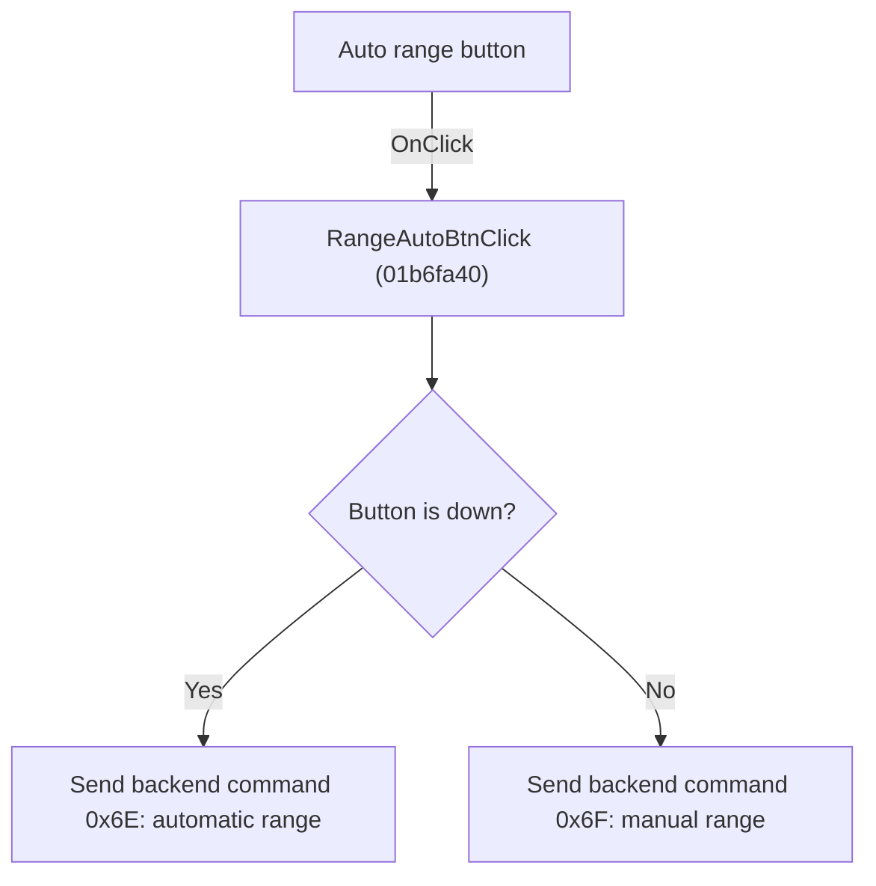

# Auto

> Analysis status: Individually reviewed.

## Control

| Property | Recovered value |
| --- | --- |
| Form | VoltmeterWin |
| Component path | VoltmeterWin.MeasRangeBox.RangeAutoBtn |
| Control class | TSpeedButton |
| Caption | Auto |
| Hint | Not present in the recovered resource. |
| Text | Not present in the recovered resource. |
| Handler name | RangeAutoBtnClick |
| Handler address | 01b6fa40 |
| Graph node | `resource:dfm:VoltmeterWin/VoltmeterWin.MeasRangeBox.RangeAutoBtn` |
| Handler node | `function:01b6fa40` |
| Graph layer | UI |

## What happens when clicked

The Auto speed button controls automatic range mode. After the VCL button toggles its Down state, the handler reads that state. A down button sends backend command 0x6E. An up button sends command 0x6F. The paired manual range handlers first force this button up and send 0x6F, which proves that 0x6E enables automatic ranging and 0x6F returns to manual ranging. The handler does not change the manual range index directly.

## Click flow

## Handler evidence

- Source: [DecompiledSources/Tina16/functions/0000000001B6FA40__FUN_01b6fa40.c](../../../DecompiledSources/Tina16/functions/0000000001B6FA40__FUN_01b6fa40.c)
- Recovered role: Toggle automatic Voltmeter ranging.
- Current graph summary: Handles 1 Delphi UI event: VoltmeterWin.MeasRangeBox.RangeAutoBtn.OnClick.
- Current graph behavior: The Auto speed button controls automatic range mode. After the VCL button toggles its Down state, the handler reads that state. A down button sends backend command 0x6E. An up button sends command 0x6F. The paired manual range handlers first force this button up and send 0x6F, which proves that 0x6E enables automatic ranging and 0x6F returns to manual ranging. The handler does not change the manual range index directly.
- Current graph evidence: FUN_01b6fa40 reads byte 0x328 from the RangeAutoBtn field and calls backend virtual slot 0xA8 with 0x6E when it is set or 0x6F when it is clear. FUN_01b6f6d0 and FUN_01b6f880 both clear the same button through the speed-button Down setter and send 0x6F before changing a manual range.
- Complexity: simple
- Distinct outgoing calls: 0

## Direct calls

- No direct call edge is present in the recovered graph.

## Resource evidence

- Kind: Not present in the recovered resource.
- Modal result: Not present in the recovered resource.
- Checked state: Not present in the recovered resource.
- List items: Not present in the recovered resource.
- Image reference: Not present in the recovered resource.
- Extracted glyph: None.

## Nearby label candidates

Nearby labels are layout candidates only. They are not proof of behavior.

- No same-parent label candidate is available.

## Analysis limits

- The backend command enumeration and Delphi method name are not recovered; the automatic and manual meanings are established by the shared button state and both manual step handlers.

