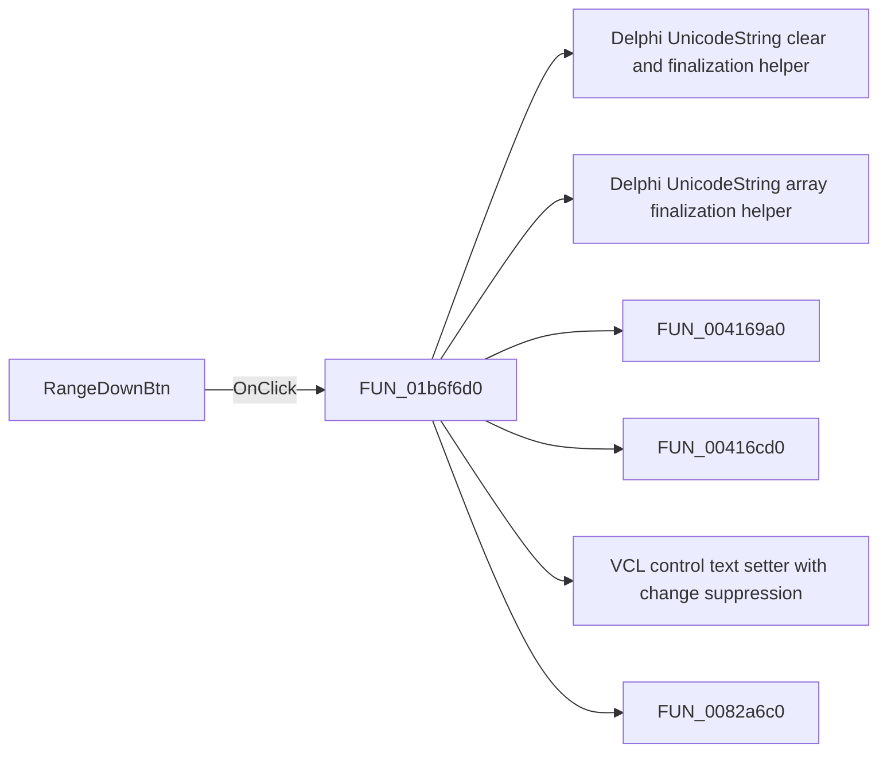

# RangeDownBtn

> Analysis status: Pending individual source review.

## Control

| Property | Recovered value |
| --- | --- |
| Form | VoltmeterWin |
| Component path | VoltmeterWin.MeasRangeBox.RangeDownBtn |
| Control class | TSpeedButton |
| Caption | Not present in the recovered resource. |
| Hint | Not present in the recovered resource. |
| Text | Not present in the recovered resource. |
| Handler name | RangeDownBtnClick |
| Handler address | 01b6f6d0 |
| Graph node | `resource:dfm:VoltmeterWin/VoltmeterWin.MeasRangeBox.RangeDownBtn` |
| Handler node | `function:01b6f6d0` |
| Graph layer | UI |

## What happens when clicked

Pending individual analysis. An agent must read the recovered handler source and its relevant callees before it replaces this text.

## Click flow

## Handler evidence

- Source: [DecompiledSources/Tina16/functions/0000000001B6F6D0__FUN_01b6f6d0.c](../../../DecompiledSources/Tina16/functions/0000000001B6F6D0__FUN_01b6f6d0.c)
- Recovered role: Not present in the recovered resource.
- Current graph summary: Handles 1 Delphi UI event: VoltmeterWin.MeasRangeBox.RangeDownBtn.OnClick.
- Current graph behavior: Not present in the recovered resource.
- Current graph evidence: Not present in the recovered resource.
- Complexity: complex
- Distinct outgoing calls: 8

## Direct calls

- `function:00414480` — Delphi UnicodeString clear and finalization helper
- `function:00414560` — Delphi UnicodeString array finalization helper
- `function:004169a0` — FUN_004169a0
- `function:00416cd0` — FUN_00416cd0
- `function:0064de00` — VCL control text setter with change suppression
- `function:0082a6c0` — FUN_0082a6c0
- `function:00b8fd60` — FUN_00b8fd60
- `function:00b909e0` — FUN_00b909e0

## Resource evidence

- Kind: Not present in the recovered resource.
- Modal result: Not present in the recovered resource.
- Checked state: Not present in the recovered resource.
- List items: Not present in the recovered resource.
- Image reference: Not present in the recovered resource.
- Extracted glyph: [`0512_VoltmeterWin_VoltmeterWin_MeasRangeBox_RangeDownBtn_Glyph_Data.png`](../../../glyph/0512_VoltmeterWin_VoltmeterWin_MeasRangeBox_RangeDownBtn_Glyph_Data.png)

## Nearby label candidates

Nearby labels are layout candidates only. They are not proof of behavior.

- No same-parent label candidate is available.

## Analysis limits

- Do not infer behavior from the control class, caption, hint, glyph, or nearby label alone.
- Do not replace the pending status until the handler source and relevant call path provide enough evidence.
