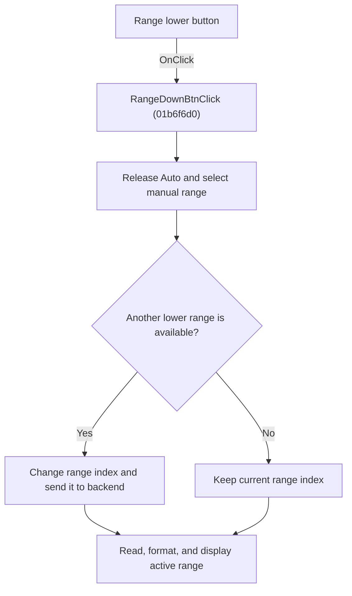

# RangeDownBtn

> Analysis status: Individually reviewed.

## Control

| Property | Recovered value |
| --- | --- |
| Form | VoltmeterWin |
| Component path | VoltmeterWin.MeasRangeBox.RangeDownBtn |
| Control class | TSpeedButton |
| Caption | Not present in the recovered resource. |
| Hint | Not present in the recovered resource. |
| Text | Not present in the recovered resource. |
| Handler name | RangeDownBtnClick |
| Handler address | 01b6f6d0 |
| Graph node | `resource:dfm:VoltmeterWin/VoltmeterWin.MeasRangeBox.RangeDownBtn` |
| Handler node | `function:01b6f6d0` |
| Graph layer | UI |

## What happens when clicked

The handler switches to manual ranging by releasing the Auto button and sending backend command 0x6F. If the current range index is greater than zero, it decrements the index and sends the new index to backend virtual slot 0x88. At the lower or upper boundary, it keeps the existing index. In both cases, it reads the active range value, formats the value with the current measurement unit, prefixes the text with Rng:, and updates the range display.

## Click flow

## Handler evidence

- Source: [DecompiledSources/Tina16/functions/0000000001B6F6D0__FUN_01b6f6d0.c](../../../DecompiledSources/Tina16/functions/0000000001B6F6D0__FUN_01b6f6d0.c)
- Recovered role: Select the next lower manual Voltmeter range.
- Current graph summary: Handles 1 Delphi UI event: VoltmeterWin.MeasRangeBox.RangeDownBtn.OnClick.
- Current graph behavior: The handler switches to manual ranging by releasing the Auto button and sending backend command 0x6F. If the current range index is greater than zero, it decrements the index and sends the new index to backend virtual slot 0x88. At the lower or upper boundary, it keeps the existing index. In both cases, it reads the active range value, formats the value with the current measurement unit, prefixes the text with Rng:, and updates the range display.
- Current graph evidence: FUN_01b6f6d0 writes range-format code 4, clears RangeAutoBtn through the recovered speed-button Down setter, sends command 0x6F, tests range byte 0x9B8 against the lower bound, conditionally changes it and calls backend slot 0x88, obtains range data through slot 0x80, formats the value and unit, and writes the Rng: string to the control at form offset 0x978. The inspected glyph points lower.
- Complexity: complex
- Distinct outgoing calls: 8

## Direct calls

- `function:00414480` — Delphi UnicodeString clear and finalization helper
- `function:00414560` — Delphi UnicodeString array finalization helper
- `function:004169a0` — FUN_004169a0
- `function:00416cd0` — FUN_00416cd0
- `function:0064de00` — VCL control text setter with change suppression
- `function:0082a6c0` — FUN_0082a6c0
- `function:00b8fd60` — FUN_00b8fd60
- `function:00b909e0` — FUN_00b909e0

## Resource evidence

- Kind: Not present in the recovered resource.
- Modal result: Not present in the recovered resource.
- Checked state: Not present in the recovered resource.
- List items: Not present in the recovered resource.
- Image reference: Not present in the recovered resource.
- Extracted glyph: [`0512_VoltmeterWin_VoltmeterWin_MeasRangeBox_RangeDownBtn_Glyph_Data.png`](../../../glyph/0512_VoltmeterWin_VoltmeterWin_MeasRangeBox_RangeDownBtn_Glyph_Data.png)

## Nearby label candidates

Nearby labels are layout candidates only. They are not proof of behavior.

- No same-parent label candidate is available.

## Analysis limits

- The numeric range values and maximum range count are supplied by the active backend and measurement mode.
- The recovered backend virtual methods do not have Delphi names.

