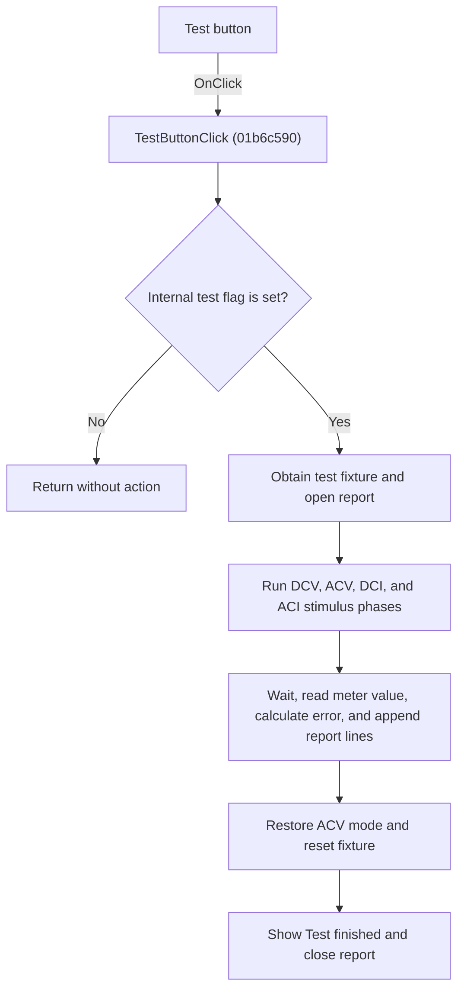

# Test

> Analysis status: Individually reviewed.

## Control

| Property | Recovered value |
| --- | --- |
| Form | VoltmeterWin |
| Component path | VoltmeterWin.TestButton |
| Control class | TSpeedButton |
| Caption | Test |
| Hint | Not present in the recovered resource. |
| Text | Not present in the recovered resource. |
| Handler name | TestButtonClick |
| Handler address | 01b6c590 |
| Graph node | `resource:dfm:VoltmeterWin/VoltmeterWin.TestButton` |
| Handler node | `function:01b6c590` |
| Graph layer | UI |

## What happens when clicked

The handler returns without action when the internal test-enable flag at form offset 0x9F0 is clear. When the flag is set, it obtains or creates the test fixture, opens the MM2_TEST and MM2TestValues.txt report target, and runs recovered DC voltage, AC voltage, DC current, and AC current test phases. Each phase changes the meter mode and fixture configuration, waits for the reading to settle, reads the measured value, calculates a percentage error against the expected value, and writes report lines. The AC voltage phase repeats across five recovered frequency values and multiple levels. The handler restores AC voltage mode, resets the fixture mode, shows Test finished., and closes the report. The recovered path has no explicit per-point retry or abort branch.

## Click flow

## Handler evidence

- Source: [DecompiledSources/Tina16/functions/0000000001B6C590__FUN_01b6c590.c](../../../DecompiledSources/Tina16/functions/0000000001B6C590__FUN_01b6c590.c)
- Recovered role: Run the gated Voltmeter calibration self-test.
- Current graph summary: Handles 1 Delphi UI event: VoltmeterWin.TestButton.OnClick.
- Current graph behavior: The handler returns without action when the internal test-enable flag at form offset 0x9F0 is clear. When the flag is set, it obtains or creates the test fixture, opens the MM2_TEST and MM2TestValues.txt report target, and runs recovered DC voltage, AC voltage, DC current, and AC current test phases. Each phase changes the meter mode and fixture configuration, waits for the reading to settle, reads the measured value, calculates a percentage error against the expected value, and writes report lines. The AC voltage phase repeats across five recovered frequency values and multiple levels. The handler restores AC voltage mode, resets the fixture mode, shows Test finished., and closes the report. The recovered path has no explicit per-point retry or abort branch.
- Current graph evidence: FUN_01b6c590 gates all work on byte 0x9F0, obtains the fixture through FUN_010e1b10 or FUN_010e1a60, uses the literal report names MM2_TEST and MM2TestValues.txt, calls the DCV, ACV, DCI, and ACI click handlers, iterates recovered stimulus tables with 3000, 4000, and 6000 millisecond waits, reads the meter value at 0x9E8, calculates percent differences, appends formatted lines, and ends with the literal Test finished. before closing the file object.
- Complexity: complex
- Distinct outgoing calls: 35

## Direct calls

- `function:00409900` — FUN_00409900
- `function:0040c760` — FUN_0040c760
- `function:0040ca00` — FUN_0040ca00
- `function:0040cf10` — FUN_0040cf10
- `function:0040d060` — FUN_0040d060
- `function:0040d150` — FUN_0040d150
- `function:0040f200` — FUN_0040f200
- `function:0040f590` — FUN_0040f590
- `function:0040fb60` — FUN_0040fb60
- `function:004100d0` — FUN_004100d0
- `function:004113f0` — FUN_004113f0
- `function:00414480` — Delphi UnicodeString clear and finalization helper
- `function:00414560` — Delphi UnicodeString array finalization helper
- `function:004169a0` — FUN_004169a0
- `function:00416ba0` — FUN_00416ba0
- `function:00416cd0` — FUN_00416cd0
- `function:00452e30` — FUN_00452e30
- `function:007fd7d0` — FUN_007fd7d0
- `function:007fd800` — FUN_007fd800
- `function:008059a0` — FUN_008059a0
- `function:00806af0` — FUN_00806af0
- `function:00806b40` — FUN_00806b40
- `function:00f835c0` — Event-pumping timed wait
- `function:010e1a60` — FUN_010e1a60
- `function:010e1b10` — FUN_010e1b10
- `function:01138af0` — FUN_01138af0
- `function:01138b30` — FUN_01138b30
- `function:01139b50` — Handles 1 Delphi UI event: FuncGenWin.WaveformBox.SinusBtn.OnClick.
- `function:01139c40` — Handles 1 Delphi UI event: FuncGenWin.WaveformBox.DCBtn.OnClick.
- `function:0113d290` — FUN_0113d290
- `function:0113d630` — FUN_0113d630
- `function:01b6e610` — Handles 1 Delphi UI event: VoltmeterWin.FunctionBox.DCVButton.OnClick.
- `function:01b6e660` — Handles 1 Delphi UI event: VoltmeterWin.FunctionBox.ACVButton.OnClick.
- `function:01b6e7b0` — Handles 1 Delphi UI event: VoltmeterWin.FunctionBox.ACIButton.OnClick.
- `function:01b6fb40` — Handles 1 Delphi UI event: VoltmeterWin.FunctionBox.DCIButton.OnClick.

## Resource evidence

- Kind: Not present in the recovered resource.
- Modal result: Not present in the recovered resource.
- Checked state: Not present in the recovered resource.
- List items: Not present in the recovered resource.
- Image reference: Not present in the recovered resource.
- Extracted glyph: None.

## Nearby label candidates

Nearby labels are layout candidates only. They are not proof of behavior.

- No same-parent label candidate is available.

## Analysis limits

- The internal condition that sets test-enable flag 0x9F0 is outside this click handler.
- The recovered source does not name the fixture class or report directory.
- The source contains no explicit per-point retry or error-dialog branch; lower-level device and file errors are not recovered here.

