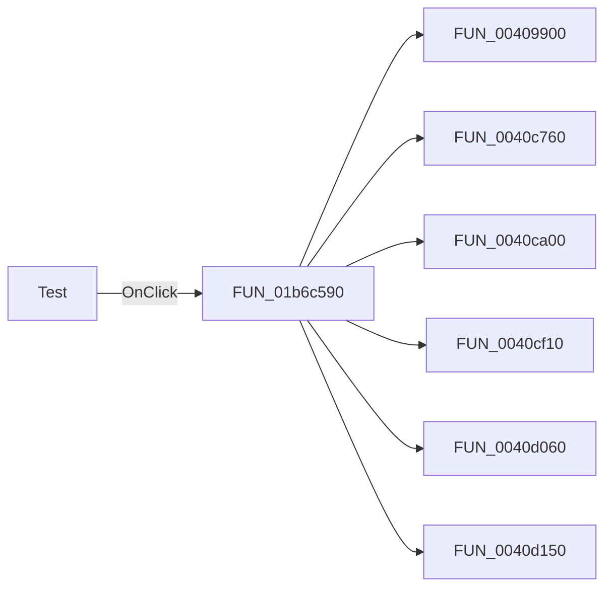

# Test

> Analysis status: Pending individual source review.

## Control

| Property | Recovered value |
| --- | --- |
| Form | VoltmeterWin |
| Component path | VoltmeterWin.TestButton |
| Control class | TSpeedButton |
| Caption | Test |
| Hint | Not present in the recovered resource. |
| Text | Not present in the recovered resource. |
| Handler name | TestButtonClick |
| Handler address | 01b6c590 |
| Graph node | `resource:dfm:VoltmeterWin/VoltmeterWin.TestButton` |
| Handler node | `function:01b6c590` |
| Graph layer | UI |

## What happens when clicked

Pending individual analysis. An agent must read the recovered handler source and its relevant callees before it replaces this text.

## Click flow

## Handler evidence

- Source: [DecompiledSources/Tina16/functions/0000000001B6C590__FUN_01b6c590.c](../../../DecompiledSources/Tina16/functions/0000000001B6C590__FUN_01b6c590.c)
- Recovered role: Not present in the recovered resource.
- Current graph summary: Handles 1 Delphi UI event: VoltmeterWin.TestButton.OnClick.
- Current graph behavior: Not present in the recovered resource.
- Current graph evidence: Not present in the recovered resource.
- Complexity: complex
- Distinct outgoing calls: 35

## Direct calls

- `function:00409900` — FUN_00409900
- `function:0040c760` — FUN_0040c760
- `function:0040ca00` — FUN_0040ca00
- `function:0040cf10` — FUN_0040cf10
- `function:0040d060` — FUN_0040d060
- `function:0040d150` — FUN_0040d150
- `function:0040f200` — FUN_0040f200
- `function:0040f590` — FUN_0040f590
- `function:0040fb60` — FUN_0040fb60
- `function:004100d0` — FUN_004100d0
- `function:004113f0` — FUN_004113f0
- `function:00414480` — Delphi UnicodeString clear and finalization helper
- `function:00414560` — Delphi UnicodeString array finalization helper
- `function:004169a0` — FUN_004169a0
- `function:00416ba0` — FUN_00416ba0
- `function:00416cd0` — FUN_00416cd0
- `function:00452e30` — FUN_00452e30
- `function:007fd7d0` — FUN_007fd7d0
- `function:007fd800` — FUN_007fd800
- `function:008059a0` — FUN_008059a0
- `function:00806af0` — FUN_00806af0
- `function:00806b40` — FUN_00806b40
- `function:00f835c0` — Event-pumping timed wait
- `function:010e1a60` — FUN_010e1a60
- `function:010e1b10` — FUN_010e1b10
- `function:01138af0` — FUN_01138af0
- `function:01138b30` — FUN_01138b30
- `function:01139b50` — Handles 1 Delphi UI event: FuncGenWin.WaveformBox.SinusBtn.OnClick.
- `function:01139c40` — Handles 1 Delphi UI event: FuncGenWin.WaveformBox.DCBtn.OnClick.
- `function:0113d290` — FUN_0113d290
- `function:0113d630` — FUN_0113d630
- `function:01b6e610` — Handles 1 Delphi UI event: VoltmeterWin.FunctionBox.DCVButton.OnClick.
- `function:01b6e660` — Handles 1 Delphi UI event: VoltmeterWin.FunctionBox.ACVButton.OnClick.
- `function:01b6e7b0` — Handles 1 Delphi UI event: VoltmeterWin.FunctionBox.ACIButton.OnClick.
- `function:01b6fb40` — Handles 1 Delphi UI event: VoltmeterWin.FunctionBox.DCIButton.OnClick.

## Resource evidence

- Kind: Not present in the recovered resource.
- Modal result: Not present in the recovered resource.
- Checked state: Not present in the recovered resource.
- List items: Not present in the recovered resource.
- Image reference: Not present in the recovered resource.
- Extracted glyph: None.

## Nearby label candidates

Nearby labels are layout candidates only. They are not proof of behavior.

- No same-parent label candidate is available.

## Analysis limits

- Do not infer behavior from the control class, caption, hint, glyph, or nearby label alone.
- Do not replace the pending status until the handler source and relevant call path provide enough evidence.
