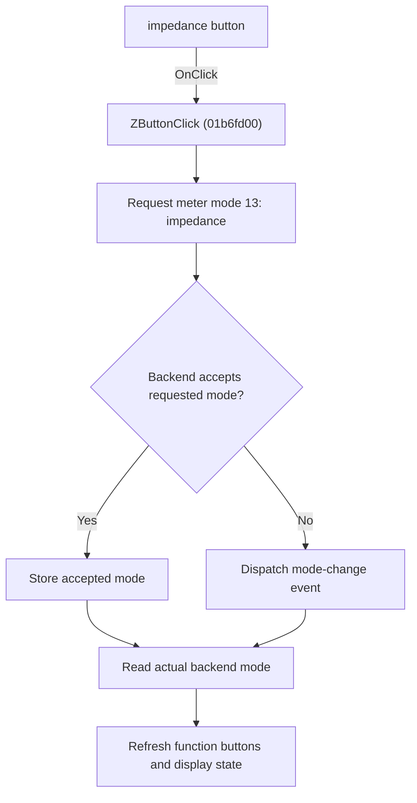

# Z

> Analysis status: Individually reviewed.

## Control

| Property | Recovered value |
| --- | --- |
| Form | VoltmeterWin |
| Component path | VoltmeterWin.FunctionBox.Zbutton |
| Control class | TSpeedButton |
| Caption | Z |
| Hint | Not present in the recovered resource. |
| Text | Not present in the recovered resource. |
| Handler name | ZButtonClick |
| Handler address | 01b6fd00 |
| Graph node | `resource:dfm:VoltmeterWin/VoltmeterWin.FunctionBox.Zbutton` |
| Handler node | `function:01b6fd00` |
| Graph layer | UI |

## What happens when clicked

The handler requests meter mode 13, which the shared control path maps to impedance. Before it requests this passive-component mode, the shared helper ends the recovered probe or measurement session and closes two related windows when they exist. If the backend accepts the request, the helper stores the accepted mode and updates the function buttons and related display state. If the backend rejects it, the helper dispatches a mode-change event instead. The handler then reads the actual backend mode and refreshes the button state, so the UI follows the mode that is active. The click does not start a measurement by itself.

## Click flow

## Handler evidence

- Source: [DecompiledSources/Tina16/functions/0000000001B6FD00__FUN_01b6fd00.c](../../../DecompiledSources/Tina16/functions/0000000001B6FD00__FUN_01b6fd00.c)
- Recovered role: Select impedance measurement mode.
- Current graph summary: Handles 1 Delphi UI event: VoltmeterWin.FunctionBox.Zbutton.OnClick.
- Current graph behavior: The handler requests meter mode 13, which the shared control path maps to impedance. Before it requests this passive-component mode, the shared helper ends the recovered probe or measurement session and closes two related windows when they exist. If the backend accepts the request, the helper stores the accepted mode and updates the function buttons and related display state. If the backend rejects it, the helper dispatches a mode-change event instead. The handler then reads the actual backend mode and refreshes the button state, so the UI follows the mode that is active. The click does not start a measurement by itself.
- Current graph evidence: FUN_01b6fd00 calls FUN_01b6e340 with constant 13, reads the actual mode through backend virtual slot 0xA0, and passes that value to FUN_01b6bcd0. The shared selector uses backend slot 0x98 as its acceptance test, stores accepted mode byte 0x9CA, and dispatches event 0x537 on rejection. FUN_01b6bcd0 maps mode 13 to the DFM-bound VoltmeterWin.FunctionBox.Zbutton button.
- Complexity: moderate
- Distinct outgoing calls: 2

## Direct calls

- `function:01b6bcd0` — FUN_01b6bcd0
- `function:01b6e340` — FUN_01b6e340

## Resource evidence

- Kind: Not present in the recovered resource.
- Modal result: Not present in the recovered resource.
- Checked state: Not present in the recovered resource.
- List items: Not present in the recovered resource.
- Image reference: Not present in the recovered resource.
- Extracted glyph: None.

## Nearby label candidates

Nearby labels are layout candidates only. They are not proof of behavior.

- No same-parent label candidate is available.

## Analysis limits

- The backend class and virtual method names are not recovered. The accepted and rejected meanings follow the repeated return-value, state-write, and refresh paths.
- The two related windows that the shared helper closes do not have recovered Delphi field names.

