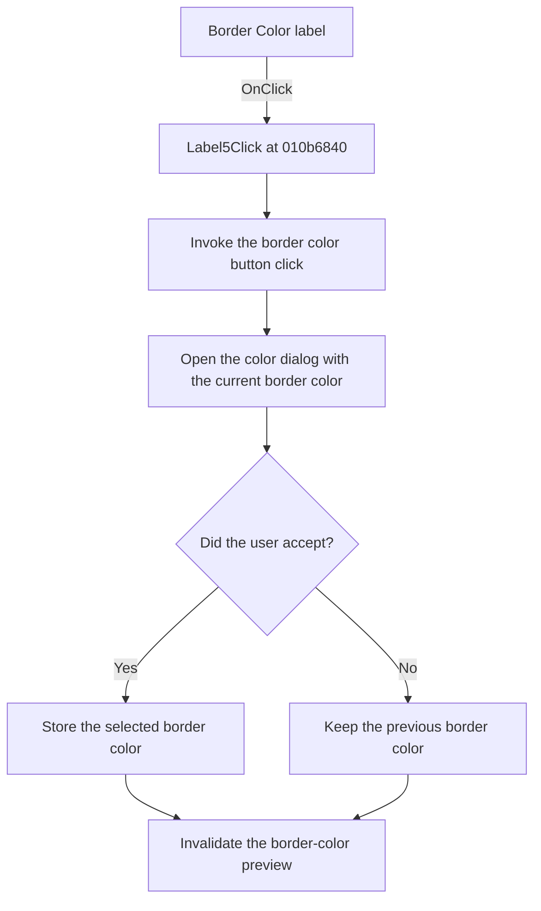

# &Color:

> Analysis status: Reviewed from recovered source and graph evidence.

## Control

| Property | Recovered value |
| --- | --- |
| Form | WMFPropsDlg |
| Component path | WMFPropsDlg.gbBorder.Label5 |
| Control class | TLabel |
| Caption | &Color: |
| Hint | Not present in the recovered resource. |
| Text | Not present in the recovered resource. |
| Handler name | Label5Click |
| Handler address | 010b6840 |
| Graph node | `resource:dfm:WMFPropsDlg/WMFPropsDlg.gbBorder.Label5` |
| Handler node | `function:010b6840` |
| Graph layer | UI |

## What happens when clicked

The handler gets the border color speed button from form offset `0x728` and invokes its recovered click dispatcher. This forwards the label click to the same `EditColor` path as `sbFrColor`.

That path opens a color dialog with the current border color. If the user accepts, it stores the selected color. If the user cancels, it keeps the previous color. In both cases, it destroys the dialog and invalidates the border paint box so that the preview repaints. The label handler does not change the nearby Thickness value and has no separate error branch.

## Click flow

## Handler evidence

- Source: [DecompiledSources/Tina16/functions/00000000010B6840__FUN_010b6840.c](../../../DecompiledSources/Tina16/functions/00000000010B6840__FUN_010b6840.c)
- Recovered role: Forwards the Color label click to the border color editor.
- Current graph summary: Handles 1 Delphi UI event: WMFPropsDlg.gbBorder.Label5.OnClick.
- Current graph behavior: The handler invokes the border color speed button, which runs the shared color-dialog path and refreshes the border preview.
- Current graph evidence: `Label5Click` resolves dynamic method `0xffea` on the control at form offset `0x728` and invokes it. The resource order identifies that control as `sbFrColor`; its `EditColor` handler uses border color field `0x798` and invalidates paint box `0x720`.
- Complexity: simple
- Distinct outgoing calls: 1

## Direct calls

- `function:00411550` — Resolves the speed button's Delphi dynamic click method before the handler invokes it.

## Resource evidence

- Kind: Not present in the recovered resource.
- Modal result: Not present in the recovered resource.
- Checked state: Not present in the recovered resource.
- List items: Not present in the recovered resource.
- Image reference: Not present in the recovered resource.
- Extracted glyph: None.

## Nearby label candidates

Nearby labels are layout candidates only. They are not proof of behavior.

- Rank 1: &Color: at distance 0.
- Rank 2: &Thickness: at distance 24.

## Analysis limits

- The original Delphi names for form offsets `0x720`, `0x728`, and `0x798` are not present in the recovered source. The component layout and shared handler branches establish their control-specific roles.
- The nearby Thickness label is not used as evidence for this click path, and the handler does not read its edit.
- The recovered code does not show a custom error message if the color dialog cannot be created or executed.
