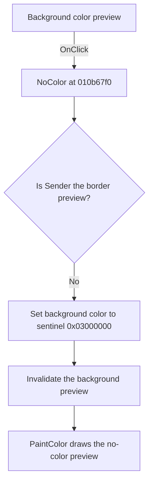

# pbBdColor

> Analysis status: Reviewed from recovered source and graph evidence.

## Control

| Property | Recovered value |
| --- | --- |
| Form | WMFPropsDlg |
| Component path | WMFPropsDlg.gbBackground.pbBdColor |
| Control class | TPaintBox |
| Caption | Not present in the recovered resource. |
| Hint | Not present in the recovered resource. |
| Text | Not present in the recovered resource. |
| Handler name | NoColor |
| Handler address | 010b67f0 |
| Graph node | `resource:dfm:WMFPropsDlg/WMFPropsDlg.gbBackground.pbBdColor` |
| Handler node | `function:010b67f0` |
| Graph layer | UI |

## What happens when clicked

The shared `NoColor` handler compares `Sender` with the border paint box. This control is the other sender, so the handler writes sentinel value `0x03000000` to background color field `0x79c` and invalidates this paint box at form offset `0x738`.

The recovered `PaintColor` handler treats that sentinel differently from a normal color. It draws the no-color preview instead of filling the preview rectangle. The click does not open a dialog or ask for confirmation. Repeating the click writes the same sentinel and requests another repaint.

## Click flow

## Handler evidence

- Source: [DecompiledSources/Tina16/functions/00000000010B67F0__FUN_010b67f0.c](../../../DecompiledSources/Tina16/functions/00000000010B67F0__FUN_010b67f0.c)
- Recovered role: Sets the selected border or fill color to the no-color sentinel.
- Current graph summary: Handles 2 Delphi UI events: WMFPropsDlg.gbBorder.pbFrColor.OnClick, WMFPropsDlg.gbBackground.pbBdColor.OnClick.
- Current graph behavior: For this sender, the shared handler clears the background color and refreshes its preview.
- Current graph evidence: `NoColor` compares `Sender` with form control `0x720`. The background paint box does not match, so it writes `0x03000000` at `0x79c` and invokes the invalidate virtual method on control `0x738`. `PaintColor` uses the same field and draws its special no-color branch for this value.
- Complexity: simple
- Distinct outgoing calls: 0

## Direct calls

- No direct call edge is present in the recovered graph.

## Resource evidence

- Kind: Not present in the recovered resource.
- Modal result: Not present in the recovered resource.
- Checked state: Not present in the recovered resource.
- List items: Not present in the recovered resource.
- Image reference: Not present in the recovered resource.
- Extracted glyph: None.

## Nearby label candidates

Nearby labels are layout candidates only. They are not proof of behavior.

- Rank 1: &Fill color: at distance 158.

## Analysis limits

- The original Delphi name and external serialization meaning of sentinel `0x03000000` are not recovered. Its no-color UI meaning is established by the handler name, dedicated None controls, and `PaintColor` branch.
- The exact drawing-method names used by the paint-box preview are not recovered.
