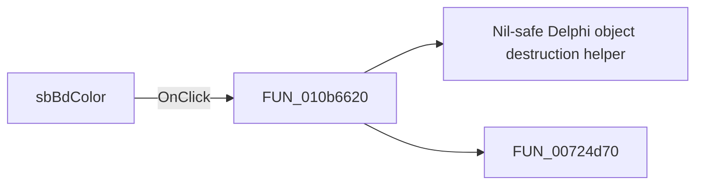

# sbBdColor

> Analysis status: Pending individual source review.

## Control

| Property | Recovered value |
| --- | --- |
| Form | WMFPropsDlg |
| Component path | WMFPropsDlg.gbBackground.sbBdColor |
| Control class | TSpeedButton |
| Caption | Not present in the recovered resource. |
| Hint | Not present in the recovered resource. |
| Text | Not present in the recovered resource. |
| Handler name | EditColor |
| Handler address | 010b6620 |
| Graph node | `resource:dfm:WMFPropsDlg/WMFPropsDlg.gbBackground.sbBdColor` |
| Handler node | `function:010b6620` |
| Graph layer | UI |

## What happens when clicked

Pending individual analysis. An agent must read the recovered handler source and its relevant callees before it replaces this text.

## Click flow

## Handler evidence

- Source: [DecompiledSources/Tina16/functions/00000000010B6620__FUN_010b6620.c](../../../DecompiledSources/Tina16/functions/00000000010B6620__FUN_010b6620.c)
- Recovered role: Not present in the recovered resource.
- Current graph summary: Handles 2 Delphi UI events: WMFPropsDlg.gbBorder.sbFrColor.OnClick, WMFPropsDlg.gbBackground.sbBdColor.OnClick.
- Current graph behavior: Not present in the recovered resource.
- Current graph evidence: Not present in the recovered resource.
- Complexity: moderate
- Distinct outgoing calls: 2

## Direct calls

- `function:00410f20` — Nil-safe Delphi object destruction helper
- `function:00724d70` — FUN_00724d70

## Resource evidence

- Kind: Not present in the recovered resource.
- Modal result: Not present in the recovered resource.
- Checked state: Not present in the recovered resource.
- List items: Not present in the recovered resource.
- Image reference: Not present in the recovered resource.
- Extracted glyph: [`0518_WMFPropsDlg_WMFPropsDlg_gbBackground_sbBdColor_Glyph_Data.png`](../../../glyph/0518_WMFPropsDlg_WMFPropsDlg_gbBackground_sbBdColor_Glyph_Data.png)

## Nearby label candidates

Nearby labels are layout candidates only. They are not proof of behavior.

- Rank 1: &Fill color: at distance 237.

## Analysis limits

- Do not infer behavior from the control class, caption, hint, glyph, or nearby label alone.
- Do not replace the pending status until the handler source and relevant call path provide enough evidence.
