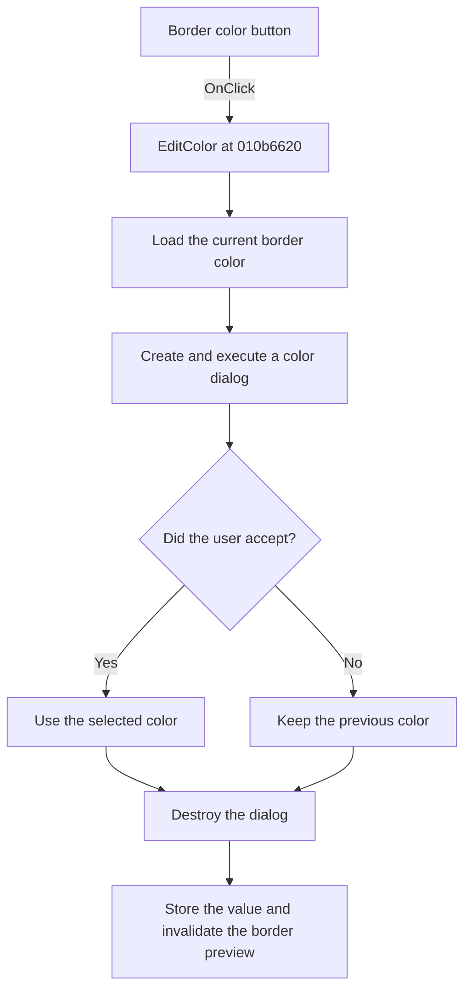

# sbFrColor

> Analysis status: Reviewed from recovered source and graph evidence.

## Control

| Property | Recovered value |
| --- | --- |
| Form | WMFPropsDlg |
| Component path | WMFPropsDlg.gbBorder.sbFrColor |
| Control class | TSpeedButton |
| Caption | Not present in the recovered resource. |
| Hint | Not present in the recovered resource. |
| Text | Not present in the recovered resource. |
| Handler name | EditColor |
| Handler address | 010b6620 |
| Graph node | `resource:dfm:WMFPropsDlg/WMFPropsDlg.gbBorder.sbFrColor` |
| Handler node | `function:010b6620` |
| Graph layer | UI |

## What happens when clicked

The shared `EditColor` handler compares `Sender` with the border color speed button. This control matches, so it loads the current border color from form field `0x798`.

It creates a color dialog, assigns the current color, and executes the dialog. If the user accepts, it reads the selected color. If the user cancels, the local value remains the original border color. It always destroys the dialog, writes the resulting value back to `0x798`, and invalidates the border paint box at form offset `0x720`. The inspected ellipsis glyph supports the dialog action but is not the only evidence.

## Click flow

## Handler evidence

- Source: [DecompiledSources/Tina16/functions/00000000010B6620__FUN_010b6620.c](../../../DecompiledSources/Tina16/functions/00000000010B6620__FUN_010b6620.c)
- Recovered role: Opens a color dialog for the selected border or fill color and refreshes its preview.
- Current graph summary: Handles 2 Delphi UI events: WMFPropsDlg.gbBorder.sbFrColor.OnClick, WMFPropsDlg.gbBackground.sbBdColor.OnClick.
- Current graph behavior: For this sender, the shared handler edits the border color and repaints the border preview; cancel keeps the current color.
- Current graph evidence: `EditColor` selects field `0x798` when `Sender` is control `0x728`, constructs a color-dialog object through `FUN_00724d70`, initializes its color field, tests its execute result, destroys it through `FUN_00410f20`, stores the result, and invalidates paint box `0x720`.
- Complexity: moderate
- Distinct outgoing calls: 2

## Direct calls

- `function:00410f20` — Destroys the color-dialog object after execution, including the cancel path.
- `function:00724d70` — Constructs and initializes the VCL color dialog.

## Resource evidence

- Kind: Not present in the recovered resource.
- Modal result: Not present in the recovered resource.
- Checked state: Not present in the recovered resource.
- List items: Not present in the recovered resource.
- Image reference: Not present in the recovered resource.
- Extracted glyph: [`0516_WMFPropsDlg_WMFPropsDlg_gbBorder_sbFrColor_Glyph_Data.png`](../../../glyph/0516_WMFPropsDlg_WMFPropsDlg_gbBorder_sbFrColor_Glyph_Data.png)

## Nearby label candidates

Nearby labels are layout candidates only. They are not proof of behavior.

- Rank 1: &Color: at distance 235.
- Rank 2: &Thickness: at distance 259.

## Analysis limits

- The recovered source does not preserve the original Delphi field names for the two colors and paint boxes.
- The nearby Thickness label is not part of this handler's data flow.
- The handler has no custom exception or error-message branch for dialog creation or execution failure.
