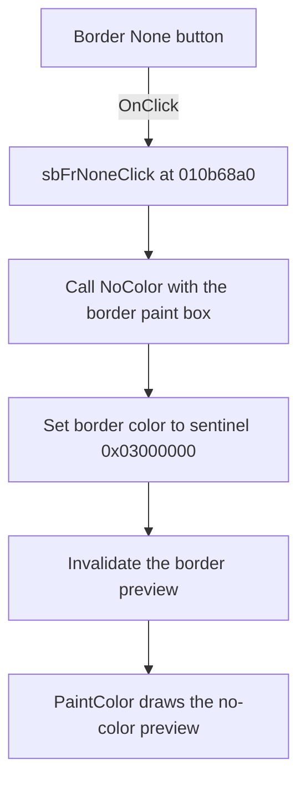

# sbFrNone

> Analysis status: Reviewed from recovered source and graph evidence.

## Control

| Property | Recovered value |
| --- | --- |
| Form | WMFPropsDlg |
| Component path | WMFPropsDlg.gbBorder.sbFrNone |
| Control class | TSpeedButton |
| Caption | Not present in the recovered resource. |
| Hint | Not present in the recovered resource. |
| Text | Not present in the recovered resource. |
| Handler name | sbFrNoneClick |
| Handler address | 010b68a0 |
| Graph node | `resource:dfm:WMFPropsDlg/WMFPropsDlg.gbBorder.sbFrNone` |
| Handler node | `function:010b68a0` |
| Graph layer | UI |

## What happens when clicked

The handler calls the shared `NoColor` routine with the border paint box as `Sender`. That routine writes sentinel value `0x03000000` to border color field `0x798` and invalidates the border paint box at form offset `0x720`.

The recovered `PaintColor` handler then draws the special no-color preview instead of a filled color rectangle. The inspected two-state glyph includes a red cross, which agrees with this path. The source and paint behavior, not the glyph alone, establish the result. The click has no confirmation or error branch. Repeating it writes the same value and requests another repaint.

## Click flow

## Handler evidence

- Source: [DecompiledSources/Tina16/functions/00000000010B68A0__FUN_010b68a0.c](../../../DecompiledSources/Tina16/functions/00000000010B68A0__FUN_010b68a0.c)
- Recovered role: Clears the border color through the shared no-color handler.
- Current graph summary: Handles 1 Delphi UI event: WMFPropsDlg.gbBorder.sbFrNone.OnClick.
- Current graph behavior: The handler selects the border branch of `NoColor`, stores the no-color sentinel, and refreshes the preview.
- Current graph evidence: `sbFrNoneClick` passes form control `0x720` to `FUN_010b67f0`. That sender selects field `0x798`, writes `0x03000000`, and invalidates the same paint box. `PaintColor` uses the sentinel branch for the preview.
- Complexity: simple
- Distinct outgoing calls: 1

## Direct calls

- `function:010b67f0` — Selects the color field from `Sender`, writes the no-color sentinel, and invalidates its paint box.

## Resource evidence

- Kind: Not present in the recovered resource.
- Modal result: Not present in the recovered resource.
- Checked state: Not present in the recovered resource.
- List items: Not present in the recovered resource.
- Image reference: Not present in the recovered resource.
- Extracted glyph: [`0517_WMFPropsDlg_WMFPropsDlg_gbBorder_sbFrNone_Glyph_Data.png`](../../../glyph/0517_WMFPropsDlg_WMFPropsDlg_gbBorder_sbFrNone_Glyph_Data.png)

## Nearby label candidates

Nearby labels are layout candidates only. They are not proof of behavior.

- Rank 1: &Color: at distance 252.
- Rank 2: &Thickness: at distance 276.

## Analysis limits

- The original Delphi name and external serialization meaning of sentinel `0x03000000` are not recovered. Its no-color UI meaning is established by the shared handler and paint path.
- The nearby Thickness label is not part of this handler's data flow.
- The exact drawing-method names used by the paint-box preview are not recovered.
