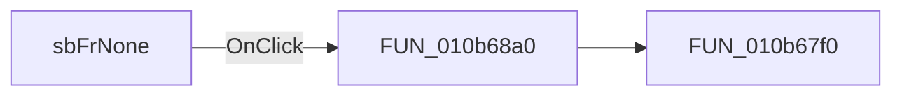

# sbFrNone

> Analysis status: Pending individual source review.

## Control

| Property | Recovered value |
| --- | --- |
| Form | WMFPropsDlg |
| Component path | WMFPropsDlg.gbBorder.sbFrNone |
| Control class | TSpeedButton |
| Caption | Not present in the recovered resource. |
| Hint | Not present in the recovered resource. |
| Text | Not present in the recovered resource. |
| Handler name | sbFrNoneClick |
| Handler address | 010b68a0 |
| Graph node | `resource:dfm:WMFPropsDlg/WMFPropsDlg.gbBorder.sbFrNone` |
| Handler node | `function:010b68a0` |
| Graph layer | UI |

## What happens when clicked

Pending individual analysis. An agent must read the recovered handler source and its relevant callees before it replaces this text.

## Click flow

## Handler evidence

- Source: [DecompiledSources/Tina16/functions/00000000010B68A0__FUN_010b68a0.c](../../../DecompiledSources/Tina16/functions/00000000010B68A0__FUN_010b68a0.c)
- Recovered role: Not present in the recovered resource.
- Current graph summary: Handles 1 Delphi UI event: WMFPropsDlg.gbBorder.sbFrNone.OnClick.
- Current graph behavior: Not present in the recovered resource.
- Current graph evidence: Not present in the recovered resource.
- Complexity: simple
- Distinct outgoing calls: 1

## Direct calls

- `function:010b67f0` — Handles 2 Delphi UI events: WMFPropsDlg.gbBorder.pbFrColor.OnClick, WMFPropsDlg.gbBackground.pbBdColor.OnClick.

## Resource evidence

- Kind: Not present in the recovered resource.
- Modal result: Not present in the recovered resource.
- Checked state: Not present in the recovered resource.
- List items: Not present in the recovered resource.
- Image reference: Not present in the recovered resource.
- Extracted glyph: [`0517_WMFPropsDlg_WMFPropsDlg_gbBorder_sbFrNone_Glyph_Data.png`](../../../glyph/0517_WMFPropsDlg_WMFPropsDlg_gbBorder_sbFrNone_Glyph_Data.png)

## Nearby label candidates

Nearby labels are layout candidates only. They are not proof of behavior.

- Rank 1: &Color: at distance 252.
- Rank 2: &Thickness: at distance 276.

## Analysis limits

- Do not infer behavior from the control class, caption, hint, glyph, or nearby label alone.
- Do not replace the pending status until the handler source and relevant call path provide enough evidence.
