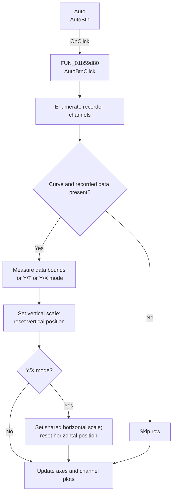

# Auto

> Analysis status: Complete. The control automatically scales the plotted recorder channels.

## Control

| Property | Recovered value |
| --- | --- |
| Form | XYRecorderWin |
| Component path | XYRecorderWin.StorageGroupBox.AutoBtn |
| Control class | TSpeedButton |
| Caption | Auto |
| Hint | Not present in the recovered resource. |
| Text | Not present in the recovered resource. |
| Handler name | AutoBtnClick |
| Handler address | 01b59d80 |
| Graph node | `resource:dfm:XYRecorderWin/XYRecorderWin.StorageGroupBox.AutoBtn` |
| Handler node | `function:01b59d80` |
| Graph layer | UI |

## What happens when clicked

`AutoBtnClick` enumerates the recorder's channel rows. For each row that has both a plot curve and recorded data, it creates a temporary range-analysis object for the current Y/T or Y/X mode. It reads the data bounds, derives a five-division scale, asks the acquisition backend to normalize the scale value and scale index, stores the channel's vertical sensitivity, and resets its vertical position to zero.

In Y/X mode, the handler also derives the shared horizontal scale from the accumulated range and resets the horizontal position to zero. It then updates the plot axes, reapplies the plot mode, and rebuilds or removes channel plot attachments to match their enabled state. Rows without both required objects are skipped. The handler changes runtime view and channel scale state only.

## Click flow

## Handler evidence

- Source: [DecompiledSources/Tina16/functions/0000000001B59D80__FUN_01b59d80.c](../../../DecompiledSources/Tina16/functions/0000000001B59D80__FUN_01b59d80.c)
- Review role: Compute automatic channel and axis scales from recorded curve bounds.
- Current graph summary: Handles 1 Delphi UI event: XYRecorderWin.StorageGroupBox.AutoBtn.OnClick.
- Current graph behavior: Not present in the recovered resource.
- Current graph evidence: Not present in the recovered resource.
- Complexity: complex
- Distinct outgoing calls: 9

## Direct calls

- `function:0040c850` — FUN_0040c850
- `function:00410f20` — Nil-safe Delphi object destruction helper
- `function:004113f0` — FUN_004113f0
- `function:00b90440` — FUN_00b90440
- `function:00b90620` — FUN_00b90620
- `function:010f67e0` — FUN_010f67e0
- `function:01b581d0` — FUN_01b581d0
- `function:01cc6020` — FUN_01cc6020
- `function:01cc6f70` — FUN_01cc6f70

## Resource evidence

- Kind: Not present in the recovered resource.
- Modal result: Not present in the recovered resource.
- Checked state: Not present in the recovered resource.
- List items: Not present in the recovered resource.
- Image reference: Not present in the recovered resource.
- Extracted glyph: None.

## Nearby label candidates

Nearby labels are layout candidates only. They are not proof of behavior.

- No same-parent label candidate is available.

## Analysis limits

- Names for the temporary range-analysis classes and backend virtual methods are not recovered. Their returned minima, maxima, scale index, and scale value establish the autoscale role.
- The source does not show an error dialog or rollback branch. A called virtual method can still raise an exception to its caller.
- A live UI or hardware test was not performed.
