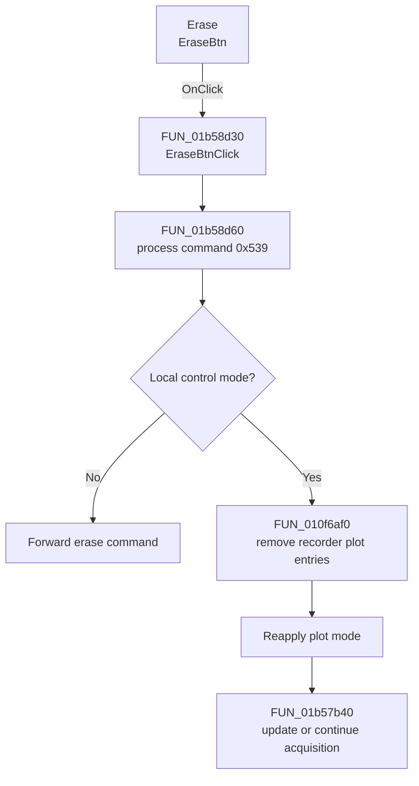

# Erase

> Analysis status: Complete. The control clears the current recorder traces and rebuilds the display state.

## Control

| Property | Recovered value |
| --- | --- |
| Form | XYRecorderWin |
| Component path | XYRecorderWin.StorageGroupBox.EraseBtn |
| Control class | TSpeedButton |
| Caption | Erase |
| Hint | Not present in the recovered resource. |
| Text | Not present in the recovered resource. |
| Handler name | EraseBtnClick |
| Handler address | 01b58d30 |
| Graph node | `resource:dfm:XYRecorderWin/XYRecorderWin.StorageGroupBox.EraseBtn` |
| Handler node | `function:01b58d30` |
| Graph layer | UI |

## What happens when clicked

`EraseBtnClick` prepares command `0x539` and calls the erase-command routine. In local mode, that routine marks an erase request, runs common acquisition cleanup, removes the channel plot attachments that apply to recorder plot mode `2`, reapplies the plot mode, and invokes the recorder update path.

If acquisition is active, the update path processes the current acquisition state and can continue the capture after the display reset. In remote mode, the command is forwarded instead of applied locally. The recovered path does not delete a disk file or write persistent settings.

## Click flow

## Handler evidence

- Source: [DecompiledSources/Tina16/functions/0000000001B58D30__FUN_01b58d30.c](../../../DecompiledSources/Tina16/functions/0000000001B58D30__FUN_01b58d30.c)
- Review role: Clear recorder plot attachments and refresh or continue the acquisition display.
- Current graph summary: Handles 1 Delphi UI event: XYRecorderWin.StorageGroupBox.EraseBtn.OnClick.
- Current graph behavior: Not present in the recovered resource.
- Current graph evidence: Not present in the recovered resource.
- Complexity: simple
- Distinct outgoing calls: 1

## Direct calls

- `function:01b58d60` — FUN_01b58d60

## Resource evidence

- Kind: Not present in the recovered resource.
- Modal result: Not present in the recovered resource.
- Checked state: Not present in the recovered resource.
- List items: Not present in the recovered resource.
- Image reference: Not present in the recovered resource.
- Extracted glyph: None.

## Nearby label candidates

Nearby labels are layout candidates only. They are not proof of behavior.

- No same-parent label candidate is available.

## Analysis limits

- The recovered function names do not identify a user-visible storage object. The source proves removal of plot attachments and an acquisition/display update, so this article does not claim deletion of saved data.
- A live UI or hardware test was not performed.
