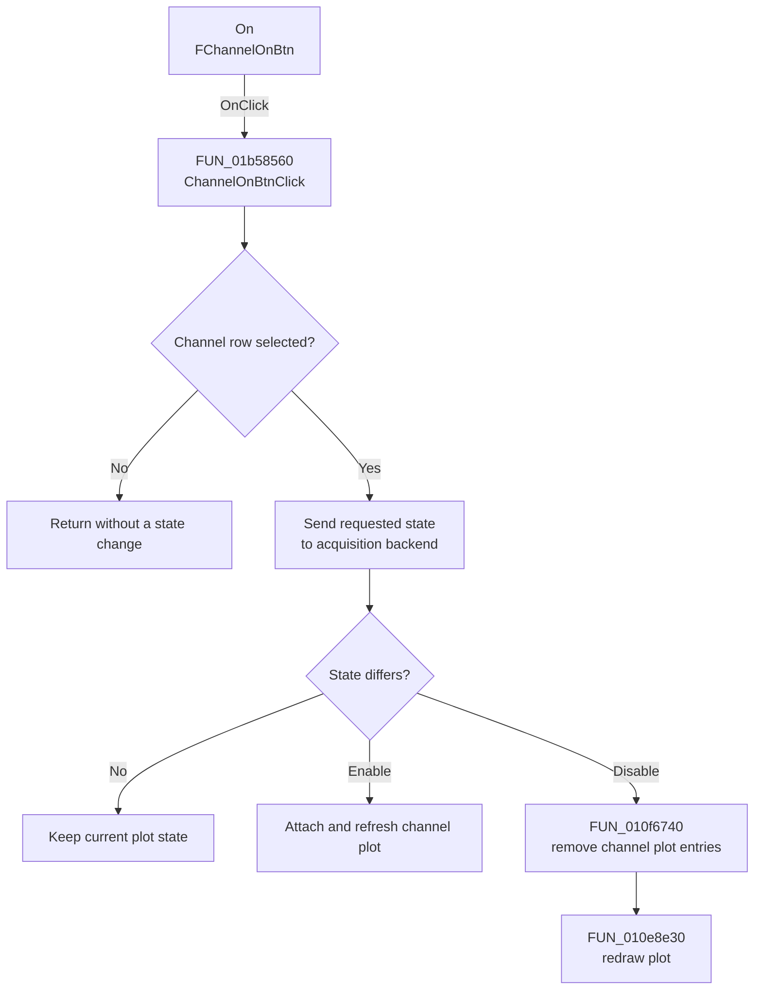

# On

> Analysis status: Complete. The control enables or disables the selected recorder channel.

## Control

| Property | Recovered value |
| --- | --- |
| Form | XYRecorderWin |
| Component path | XYRecorderWin.YChannelGroupBox.FChannelOnBtn |
| Control class | TSpeedButton |
| Caption | On |
| Hint | Not present in the recovered resource. |
| Text | Not present in the recovered resource. |
| Handler name | ChannelOnBtnClick |
| Handler address | 01b58560 |
| Graph node | `resource:dfm:XYRecorderWin/XYRecorderWin.YChannelGroupBox.FChannelOnBtn` |
| Handler node | `function:01b58560` |
| Graph layer | UI |

## What happens when clicked

`ChannelOnBtnClick` reads the selected row from `FChannelBox`. If no row is selected, it returns without a state change. Otherwise, it sends the `On` button state to the acquisition backend for that channel and compares the requested state with the channel object's active byte.

When a change to off is required, the handler clears the active byte, removes the channel's primary and secondary plot entries, and redraws the plot. When a change to on is required, it calls the form's channel-attachment virtual method to add and refresh the channel. If the channel already has the requested state, no plot operation is repeated.

## Click flow

## Handler evidence

- Source: [DecompiledSources/Tina16/functions/0000000001B58560__FUN_01b58560.c](../../../DecompiledSources/Tina16/functions/0000000001B58560__FUN_01b58560.c)
- Review role: Apply the On state to the selected recorder channel and its plot entries.
- Current graph summary: Handles 1 Delphi UI event: XYRecorderWin.YChannelGroupBox.FChannelOnBtn.OnClick.
- Current graph behavior: Not present in the recovered resource.
- Current graph evidence: Not present in the recovered resource.
- Complexity: moderate
- Distinct outgoing calls: 2

## Direct calls

- `function:010e8e30` — FUN_010e8e30
- `function:010f6740` — FUN_010f6740

## Resource evidence

- Kind: Not present in the recovered resource.
- Modal result: Not present in the recovered resource.
- Checked state: Not present in the recovered resource.
- List items: Not present in the recovered resource.
- Image reference: Not present in the recovered resource.
- Extracted glyph: None.

## Nearby label candidates

Nearby labels are layout candidates only. They are not proof of behavior.

- Rank 1: Position at distance 130.
- Rank 2: Volts/Div at distance 168.

## Analysis limits

- The channel-attachment operation is an indirect form virtual call at slot `+0x550`; its original Delphi name is not recovered. The paired detach helper and channel active byte establish its role.
- A live UI or hardware test was not performed. The handler changes runtime channel and plot state only.
