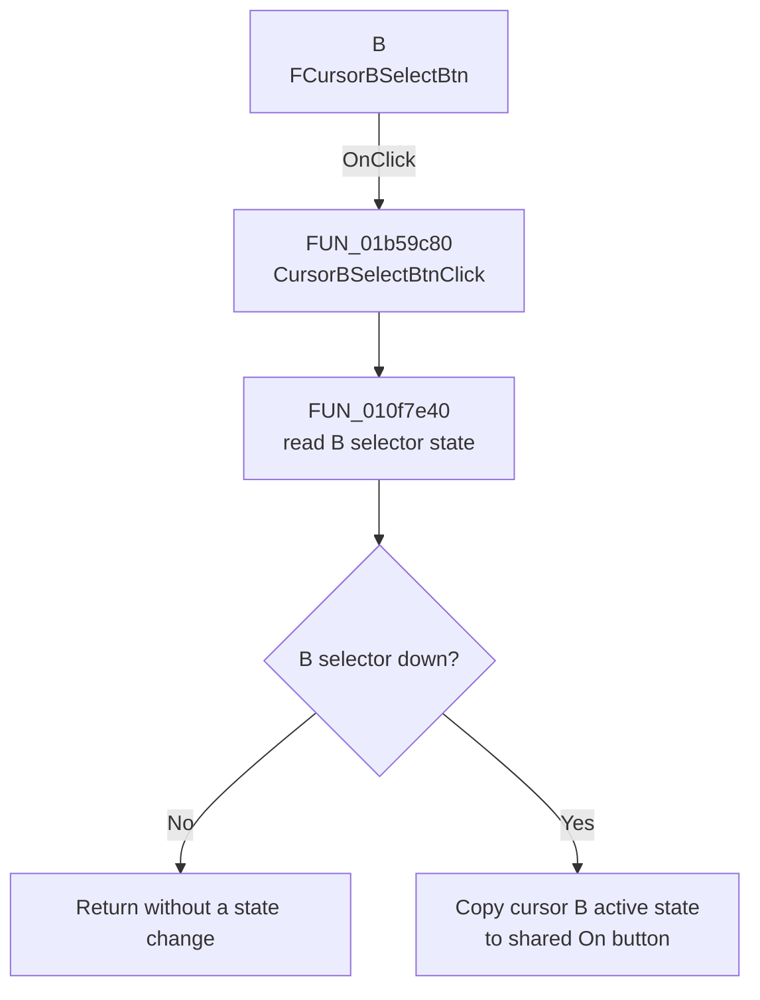

# B

> Analysis status: Complete. The control selects cursor B for the shared cursor controls.

## Control

| Property | Recovered value |
| --- | --- |
| Form | XYRecorderWin |
| Component path | XYRecorderWin.CursorBox.FCursorBSelectBtn |
| Control class | TSpeedButton |
| Caption | B |
| Hint | Not present in the recovered resource. |
| Text | Not present in the recovered resource. |
| Handler name | CursorBSelectBtnClick |
| Handler address | 01b59c80 |
| Graph node | `resource:dfm:XYRecorderWin/XYRecorderWin.CursorBox.FCursorBSelectBtn` |
| Handler node | `function:01b59c80` |
| Graph layer | UI |

## What happens when clicked

When the B selector is down, `CursorBSelectBtnClick` copies cursor B's active state to the shared `On` button. This makes the shared button show whether cursor B is enabled. The handler does not create, move, or remove a cursor.

If the B selector is not down, the handler returns without a state change. It does not write persistent data and has no local error branch.

## Click flow

## Handler evidence

- Source: [DecompiledSources/Tina16/functions/0000000001B59C80__FUN_01b59c80.c](../../../DecompiledSources/Tina16/functions/0000000001B59C80__FUN_01b59c80.c)
- Review role: Select cursor B and synchronize the shared cursor-enable button.
- Current graph summary: Handles 1 Delphi UI event: XYRecorderWin.CursorBox.FCursorBSelectBtn.OnClick.
- Current graph behavior: Not present in the recovered resource.
- Current graph evidence: Not present in the recovered resource.
- Complexity: simple
- Distinct outgoing calls: 1

## Direct calls

- `function:010f7e40` — FUN_010f7e40

## Resource evidence

- Kind: Not present in the recovered resource.
- Modal result: Not present in the recovered resource.
- Checked state: Not present in the recovered resource.
- List items: Not present in the recovered resource.
- Image reference: Not present in the recovered resource.
- Extracted glyph: None.

## Nearby label candidates

Nearby labels are layout candidates only. They are not proof of behavior.

- No same-parent label candidate is available.

## Analysis limits

- The recovered code identifies cursor B and the active-state copy through form fields and the paired A and B handlers. The original Delphi field names for the controller bytes are not present.
- A live UI test was not performed. The DFM binding and recovered handler path agree on the selection behavior.
