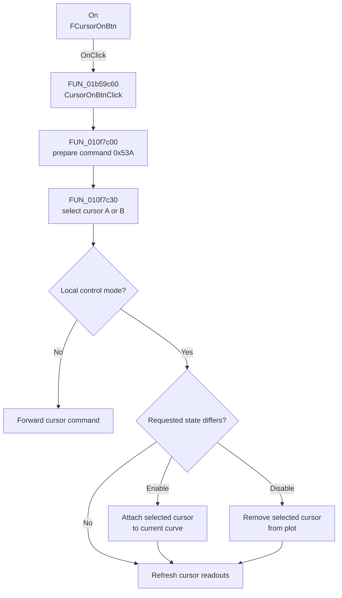

# On

> Analysis status: Complete. The control enables or disables the selected plot cursor.

## Control

| Property | Recovered value |
| --- | --- |
| Form | XYRecorderWin |
| Component path | XYRecorderWin.CursorBox.FCursorOnBtn |
| Control class | TSpeedButton |
| Caption | On |
| Hint | Not present in the recovered resource. |
| Text | Not present in the recovered resource. |
| Handler name | CursorOnBtnClick |
| Handler address | 01b59c60 |
| Graph node | `resource:dfm:XYRecorderWin/XYRecorderWin.CursorBox.FCursorOnBtn` |
| Handler node | `function:01b59c60` |
| Graph layer | UI |

## What happens when clicked

`CursorOnBtnClick` sends command `0x53A` to the common cursor-toggle routine. In local mode, the routine selects cursor A when the A selector is down. Otherwise, it selects cursor B.

When the shared `On` button is down and the selected cursor is inactive, the routine attaches that cursor to the current plot curve and initializes its position. When the button is up and the selected cursor is active, it removes the cursor from the plot. If the requested state already matches the cursor state, it does not repeat the add or remove operation. The routine then refreshes the cursor values. In remote mode, it forwards the command instead of changing the local plot directly.

## Click flow

## Handler evidence

- Source: [DecompiledSources/Tina16/functions/0000000001B59C60__FUN_01b59c60.c](../../../DecompiledSources/Tina16/functions/0000000001B59C60__FUN_01b59c60.c)
- Review role: Toggle the active state of the selected plot cursor.
- Current graph summary: Handles 1 Delphi UI event: XYRecorderWin.CursorBox.FCursorOnBtn.OnClick.
- Current graph behavior: Not present in the recovered resource.
- Current graph evidence: Not present in the recovered resource.
- Complexity: simple
- Distinct outgoing calls: 1

## Direct calls

- `function:010f7c00` — FUN_010f7c00

## Resource evidence

- Kind: Not present in the recovered resource.
- Modal result: Not present in the recovered resource.
- Checked state: Not present in the recovered resource.
- List items: Not present in the recovered resource.
- Image reference: Not present in the recovered resource.
- Extracted glyph: None.

## Nearby label candidates

Nearby labels are layout candidates only. They are not proof of behavior.

- No same-parent label candidate is available.

## Analysis limits

- The remote transport target and protocol are outside this click path. The recovered code proves that remote mode forwards command `0x53A`.
- A live UI test was not performed. The DFM binding, command helper, cursor attach and remove routines, and readout refresh path were inspected.
