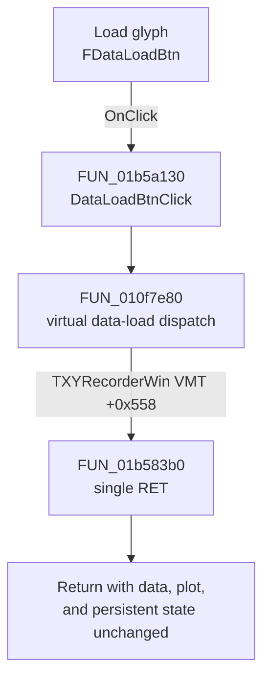

# FDataLoadBtn

> Analysis status: Complete. The recovered click path is a no-op for XYRecorderWin.

## Control

| Property | Recovered value |
| --- | --- |
| Form | XYRecorderWin |
| Component path | XYRecorderWin.DataBox.FDataLoadBtn |
| Control class | TSpeedButton |
| Caption | Not present in the recovered resource. |
| Hint | Not present in the recovered resource. |
| Text | Not present in the recovered resource. |
| Handler name | DataLoadBtnClick |
| Handler address | 01b5a130 |
| Graph node | `resource:dfm:XYRecorderWin/XYRecorderWin.DataBox.FDataLoadBtn` |
| Handler node | `function:01b5a130` |
| Graph layer | UI |

## What happens when clicked

The button does not load data in the recovered executable. `DataLoadBtnClick` calls `FUN_010f7e80`, which invokes form virtual-method slot `+0x558`. The recovered `TXYRecorderWin` VMT maps this slot to `FUN_01b583b0`.

`FUN_01b583b0` is one `RET` instruction followed by alignment bytes. It does not open a file dialog, read data, change plot state, report an error, or write persistent state.

## Click flow

## Handler evidence

- Source: [DecompiledSources/Tina16/functions/0000000001B5A130__FUN_01b5a130.c](../../../DecompiledSources/Tina16/functions/0000000001B5A130__FUN_01b5a130.c)
- Review role: Dispatch a disabled XY Recorder data-load command.
- Current graph summary: Handles 1 Delphi UI event: XYRecorderWin.DataBox.FDataLoadBtn.OnClick.
- Current graph behavior: Not present in the recovered resource.
- Current graph evidence: Not present in the recovered resource.
- Complexity: simple
- Distinct outgoing calls: 1

## Direct calls

- `function:010f7e80` — FUN_010f7e80

## Resource evidence

- Kind: Not present in the recovered resource.
- Modal result: Not present in the recovered resource.
- Checked state: Not present in the recovered resource.
- List items: Not present in the recovered resource.
- Image reference: Not present in the recovered resource.
- Extracted glyph: [`0531_XYRecorderWin_XYRecorderWin_DataBox_FDataLoadBtn_Glyph_Data.png`](../../../glyph/0531_XYRecorderWin_XYRecorderWin_DataBox_FDataLoadBtn_Glyph_Data.png)

## Nearby label candidates

Nearby labels are layout candidates only. They are not proof of behavior.

- No same-parent label candidate is available.

## Analysis limits

- The embedded plot-and-inward-arrow glyph suggests import direction, but the source and VMT prove that this form's operation is disabled.
- The class VMT is based at `01b54868`. Its class-name pointer at `01b547e0` identifies `TXYRecorderWin`; the `+0x558` entry at `01b54dc0` contains `01b583b0`. The target bytes start with `C3`.
- A live UI test was not performed. Other analyzer forms can map the shared dispatcher to a different method.
