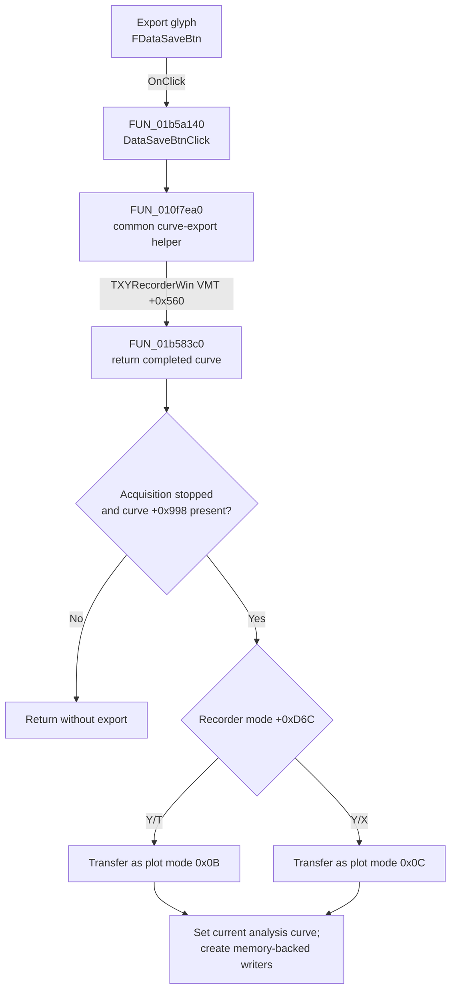

# FDataSaveBtn

> Analysis status: Complete. The control publishes a completed XY Recorder curve in memory; it does not save a file.

## Control

| Property | Recovered value |
| --- | --- |
| Form | XYRecorderWin |
| Component path | XYRecorderWin.DataBox.FDataSaveBtn |
| Control class | TSpeedButton |
| Caption | Not present in the recovered resource. |
| Hint | Not present in the recovered resource. |
| Text | Not present in the recovered resource. |
| Handler name | DataSaveBtnClick |
| Handler address | 01b5a140 |
| Graph node | `resource:dfm:XYRecorderWin/XYRecorderWin.DataBox.FDataSaveBtn` |
| Handler node | `function:01b5a140` |
| Graph layer | UI |

## What happens when clicked

`DataSaveBtnClick` calls the common curve-export helper `FUN_010f7ea0`. That helper invokes form virtual-method slot `+0x560`. The recovered `TXYRecorderWin` VMT maps this slot to `FUN_01b583c0`.

The XY Recorder virtual method returns a curve only when acquisition is stopped and a completed curve exists at form offset `+0x998`. It first transfers the curve to the plot manager with mode `0x0B` for Y/T or `0x0C` for Y/X. It then returns the curve, releases the form-owned reference, and clears the form's buffered-curve field. If acquisition is active or the buffer is empty, the click is a no-op.

Because `XYRecorderWin.FormCreate` sets the analyzer type byte to `7`, the common helper accepts the returned curve. It makes the curve the current application analysis source, clears the prior current-curve slot, and creates two memory-backed `TCurveWriter` support objects. The path opens no save dialog and writes no file.

## Click flow

## Handler evidence

- Source: [DecompiledSources/Tina16/functions/0000000001B5A140__FUN_01b5a140.c](../../../DecompiledSources/Tina16/functions/0000000001B5A140__FUN_01b5a140.c)
- Review role: Publish the completed XY Recorder curve to the in-memory analysis workspace.
- Current graph summary: Handles 1 Delphi UI event: XYRecorderWin.DataBox.FDataSaveBtn.OnClick.
- Current graph behavior: Not present in the recovered resource.
- Current graph evidence: Not present in the recovered resource.
- Complexity: simple
- Distinct outgoing calls: 1

## Direct calls

- `function:010f7ea0` — FUN_010f7ea0

## Resource evidence

- Kind: Not present in the recovered resource.
- Modal result: Not present in the recovered resource.
- Checked state: Not present in the recovered resource.
- List items: Not present in the recovered resource.
- Image reference: Not present in the recovered resource.
- Extracted glyph: [`0530_XYRecorderWin_XYRecorderWin_DataBox_FDataSaveBtn_Glyph_Data.png`](../../../glyph/0530_XYRecorderWin_XYRecorderWin_DataBox_FDataSaveBtn_Glyph_Data.png)

## Nearby label candidates

Nearby labels are layout candidates only. They are not proof of behavior.

- No same-parent label candidate is available.

## Analysis limits

- The embedded plot-and-outward-arrow glyph supports export direction. It does not prove a file format or destination, and the recovered path performs no file I/O.
- The class VMT is based at `01b54868`. Its class-name pointer at `01b547e0` identifies `TXYRecorderWin`; the `+0x560` entry at `01b54dc8` contains `01b583c0`.
- The exact sample record layout and later uses of the published analysis curve are outside this click path.
- A live UI test was not performed. The DFM binding, VMT target, form-type initialization, and common export helper were inspected.
