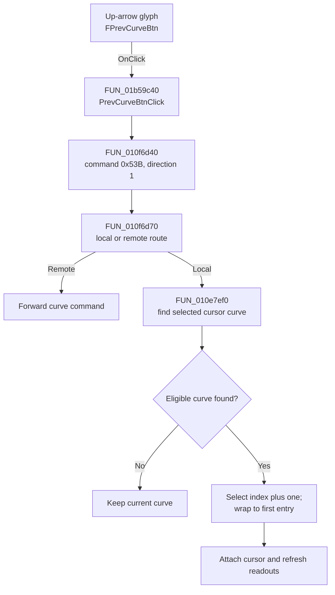

# FPrevCurveBtn

> Analysis status: Complete. The control selects the following curve-list entry for the selected cursor.

## Control

| Property | Recovered value |
| --- | --- |
| Form | XYRecorderWin |
| Component path | XYRecorderWin.CursorBox.FPrevCurveBtn |
| Control class | TSpeedButton |
| Caption | Not present in the recovered resource. |
| Hint | Not present in the recovered resource. |
| Text | Not present in the recovered resource. |
| Handler name | PrevCurveBtnClick |
| Handler address | 01b59c40 |
| Graph node | `resource:dfm:XYRecorderWin/XYRecorderWin.CursorBox.FPrevCurveBtn` |
| Handler node | `function:01b59c40` |
| Graph layer | UI |

## What happens when clicked

`PrevCurveBtnClick` sends command `0x53B` with direction value `1`. In local mode, the command acts on cursor A when the A selector is down and on cursor B otherwise. The cursor helper finds the selected cursor's current curve, adds one to its curve-list index, and wraps from the last entry to index `0`.

If the plot mode is not eligible, the selected cursor has no curve, or the current curve is not in the list, the curve does not change. After a successful selection, the helper preserves the cursor position, attaches the cursor to the replacement curve, updates cursor state, and refreshes the cursor readouts. In remote mode, the command is forwarded instead of applied locally.

## Click flow

## Handler evidence

- Source: [DecompiledSources/Tina16/functions/0000000001B59C40__FUN_01b59c40.c](../../../DecompiledSources/Tina16/functions/0000000001B59C40__FUN_01b59c40.c)
- Review role: Move the selected cursor to the next curve-list index with wraparound.
- Current graph summary: Handles 1 Delphi UI event: XYRecorderWin.CursorBox.FPrevCurveBtn.OnClick.
- Current graph behavior: Not present in the recovered resource.
- Current graph evidence: Not present in the recovered resource.
- Complexity: simple
- Distinct outgoing calls: 1

## Direct calls

- `function:010f6d40` — FUN_010f6d40

## Resource evidence

- Kind: Not present in the recovered resource.
- Modal result: Not present in the recovered resource.
- Checked state: Not present in the recovered resource.
- List items: Not present in the recovered resource.
- Image reference: Not present in the recovered resource.
- Extracted glyph: [`0527_XYRecorderWin_XYRecorderWin_CursorBox_FPrevCurveBtn_Glyph_Data.png`](../../../glyph/0527_XYRecorderWin_XYRecorderWin_CursorBox_FPrevCurveBtn_Glyph_Data.png)

## Nearby label candidates

Nearby labels are layout candidates only. They are not proof of behavior.

- No same-parent label candidate is available.

## Analysis limits

- The Delphi handler name says `Prev`, while the recovered direction-one path adds one to the list index. This article states the proven index operation and does not infer the list's visual sort order.
- A live UI test was not performed. The embedded up-arrow glyph supports navigation direction but does not establish the index operation by itself.
