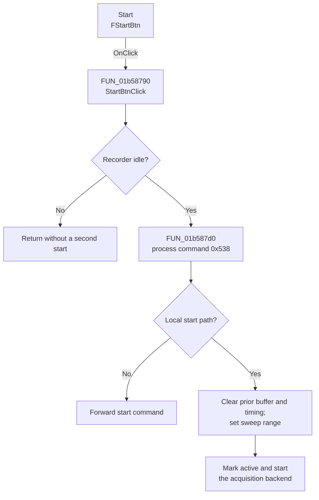

# Start

> Analysis status: Complete. The control starts XY Recorder acquisition when the recorder is idle.

## Control

| Property | Recovered value |
| --- | --- |
| Form | XYRecorderWin |
| Component path | XYRecorderWin.StorageGroupBox.FStartBtn |
| Control class | TSpeedButton |
| Caption | Start |
| Hint | Not present in the recovered resource. |
| Text | Not present in the recovered resource. |
| Handler name | StartBtnClick |
| Handler address | 01b58790 |
| Graph node | `resource:dfm:XYRecorderWin/XYRecorderWin.StorageGroupBox.FStartBtn` |
| Handler node | `function:01b58790` |
| Graph layer | UI |

## What happens when clicked

`StartBtnClick` prepares command `0x538`. If the recorder is already active, it returns without starting a second acquisition. Otherwise, the command routine checks the local or remote route and the recorder's start conditions.

On the local start path, it marks acquisition active, clears the completed-curve buffer and timing fields, resets the horizontal-position editor, sets the plot range for the configured sweep, disables two acquisition-setting controls, and suspends normal plot refresh while samples arrive. When the acquisition backend does not report immediate completion, it enables the Stop control and calls the form's acquisition-start virtual method. A remote route forwards the command instead of changing local acquisition state.

## Click flow

## Handler evidence

- Source: [DecompiledSources/Tina16/functions/0000000001B58790__FUN_01b58790.c](../../../DecompiledSources/Tina16/functions/0000000001B58790__FUN_01b58790.c)
- Review role: Start an idle XY Recorder acquisition and initialize its runtime display state.
- Current graph summary: Handles 1 Delphi UI event: XYRecorderWin.StorageGroupBox.FStartBtn.OnClick.
- Current graph behavior: Not present in the recovered resource.
- Current graph evidence: Not present in the recovered resource.
- Complexity: simple
- Distinct outgoing calls: 1

## Direct calls

- `function:01b587d0` — FUN_01b587d0

## Resource evidence

- Kind: Not present in the recovered resource.
- Modal result: Not present in the recovered resource.
- Checked state: Not present in the recovered resource.
- List items: Not present in the recovered resource.
- Image reference: Not present in the recovered resource.
- Extracted glyph: None.

## Nearby label candidates

Nearby labels are layout candidates only. They are not proof of behavior.

- No same-parent label candidate is available.

## Analysis limits

- The optional instrument preparation branch uses recovered virtual calls whose hardware-specific names are unknown. This article does not assign an instrument model or protocol.
- The click changes runtime acquisition and display state. No file or persistent preference write is present in the recovered path.
- A live acquisition test was not performed.
