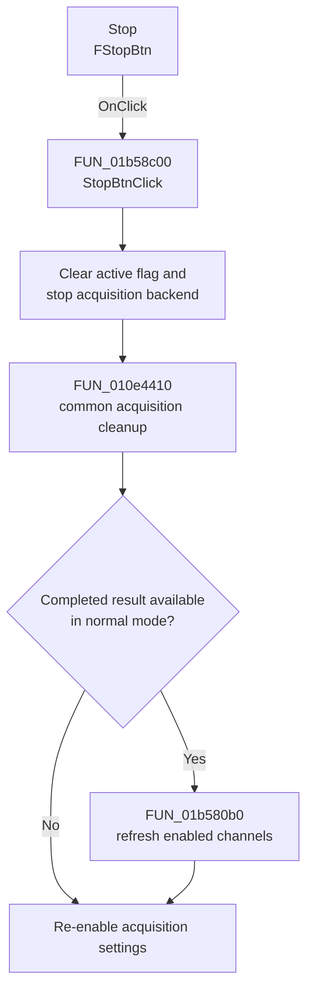

# Stop

> Analysis status: Complete. The control stops XY Recorder acquisition and restores the stopped display state.

## Control

| Property | Recovered value |
| --- | --- |
| Form | XYRecorderWin |
| Component path | XYRecorderWin.StorageGroupBox.FStopBtn |
| Control class | TSpeedButton |
| Caption | Stop |
| Hint | Not present in the recovered resource. |
| Text | Not present in the recovered resource. |
| Handler name | StopBtnClick |
| Handler address | 01b58c00 |
| Graph node | `resource:dfm:XYRecorderWin/XYRecorderWin.StorageGroupBox.FStopBtn` |
| Handler node | `function:01b58c00` |
| Graph layer | UI |

## What happens when clicked

`StopBtnClick` clears the recorder's active flag, keeps the Stop speed button down, and invokes the acquisition backend's stop operation. It then performs the common acquisition cleanup. An optional instrument object also receives its stop or finish virtual call.

For the normal recorder mode, the handler retains the latest completed curve when one is available, processes each enabled channel through the form's plot-attachment method, and refreshes the stopped result. Finally, it re-enables the two acquisition-setting controls that the Start path disables. The recovered handler has no file-write or persistent-setting operation.

## Click flow

## Handler evidence

- Source: [DecompiledSources/Tina16/functions/0000000001B58C00__FUN_01b58c00.c](../../../DecompiledSources/Tina16/functions/0000000001B58C00__FUN_01b58c00.c)
- Review role: Stop acquisition, preserve the completed result when available, and restore controls.
- Current graph summary: Handles 1 Delphi UI event: XYRecorderWin.StorageGroupBox.FStopBtn.OnClick.
- Current graph behavior: Not present in the recovered resource.
- Current graph evidence: Not present in the recovered resource.
- Complexity: complex
- Distinct outgoing calls: 7

## Direct calls

- `function:004113f0` — FUN_004113f0
- `function:0082a6c0` — FUN_0082a6c0
- `function:010e1b10` — FUN_010e1b10
- `function:010e4410` — FUN_010e4410
- `function:01b580b0` — FUN_01b580b0
- `function:01cc6020` — FUN_01cc6020
- `function:01cc6030` — FUN_01cc6030

## Resource evidence

- Kind: Not present in the recovered resource.
- Modal result: Not present in the recovered resource.
- Checked state: Not present in the recovered resource.
- List items: Not present in the recovered resource.
- Image reference: Not present in the recovered resource.
- Extracted glyph: None.

## Nearby label candidates

Nearby labels are layout candidates only. They are not proof of behavior.

- No same-parent label candidate is available.

## Analysis limits

- The backend and optional instrument virtual-method names are not recovered. Their roles follow from the active-state transition and the surrounding start, callback, and cleanup paths.
- A live hardware test was not performed. No file or persistent preference write is present in the handler.
