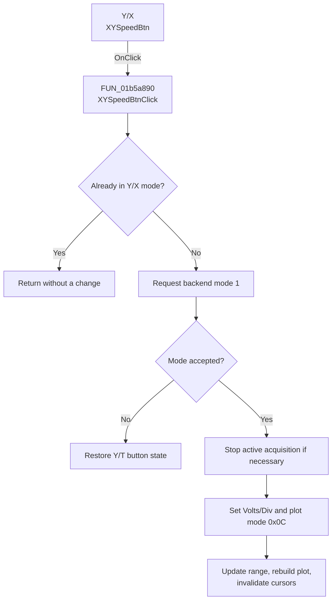

# Y/X

> Analysis status: Complete. The control changes the recorder to Y/X plotting mode.

## Control

| Property | Recovered value |
| --- | --- |
| Form | XYRecorderWin |
| Component path | XYRecorderWin.XChannelGroupBox.XYSpeedBtn |
| Control class | TSpeedButton |
| Caption | Y/X |
| Hint | Not present in the recovered resource. |
| Text | Not present in the recovered resource. |
| Handler name | XYSpeedBtnClick |
| Handler address | 01b5a890 |
| Graph node | `resource:dfm:XYRecorderWin/XYRecorderWin.XChannelGroupBox.XYSpeedBtn` |
| Handler node | `function:01b5a890` |
| Graph layer | UI |

## What happens when clicked

If the recorder is already in Y/X mode, `XYSpeedBtnClick` returns without changing state. Otherwise, it requests Y/X mode from the acquisition backend. If the backend rejects the request, the handler restores the Y/T button state and returns.

For an accepted change, the handler stops an active acquisition before it changes the axes. It selects backend mode `1`, changes the horizontal-scale label to `Volts/Div`, changes the plot-mode byte to `0x0C`, obtains the horizontal voltage scale from the selected X source, updates the scale editor and plot range, removes plot entries for the old mode, reapplies the plot mode, and invalidates both cursor caches. The click changes runtime acquisition and display state only.

## Click flow

## Handler evidence

- Source: [DecompiledSources/Tina16/functions/0000000001B5A890__FUN_01b5a890.c](../../../DecompiledSources/Tina16/functions/0000000001B5A890__FUN_01b5a890.c)
- Review role: Switch the recorder from Y/T to Y/X plotting and rebuild its axes.
- Current graph summary: Handles 1 Delphi UI event: XYRecorderWin.XChannelGroupBox.XYSpeedBtn.OnClick.
- Current graph behavior: Not present in the recovered resource.
- Current graph evidence: Not present in the recovered resource.
- Complexity: complex
- Distinct outgoing calls: 6

## Direct calls

- `function:0064de00` — VCL control text setter with change suppression
- `function:0082a6c0` — FUN_0082a6c0
- `function:00b90440` — FUN_00b90440
- `function:010e7b90` — FUN_010e7b90
- `function:010f6af0` — FUN_010f6af0
- `function:01b581d0` — FUN_01b581d0

## Resource evidence

- Kind: Not present in the recovered resource.
- Modal result: Not present in the recovered resource.
- Checked state: Not present in the recovered resource.
- List items: Not present in the recovered resource.
- Image reference: Not present in the recovered resource.
- Extracted glyph: None.

## Nearby label candidates

Nearby labels are layout candidates only. They are not proof of behavior.

- Rank 1: Mode at distance 52.
- Rank 2: Position at distance 86.
- Rank 3: Volts/Div at distance 124.

## Analysis limits

- The recovered backend method can reject the requested mode, but the reason and user notification behavior are not visible in this handler.
- A live UI or hardware test was not performed. No file or persistent-setting write is present.
